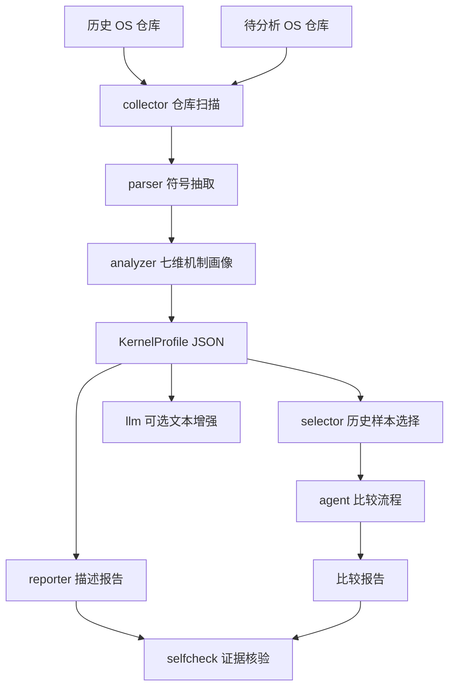

<p align="center">
  
</p>

# KernelSage-面向小型操作系统仓库的智能分析比对系统

<p align="center">
  
  
  
  
  
</p>

KernelSage 是面向小型操作系统仓库的分析比对智能体系统。系统接收一个 OS 源码仓库，自动扫描代码结构，提取调度、内存、系统调用、文件系统、中断、驱动、同步等核心机制，生成带源码路径和行号证据的描述报告，并与历史 OS 样本库进行多维比较，辅助评审或参赛团队识别相似设计、差异点、可能创新点和需要人工复核的疑似重复线索。

## 目录

- [一、基本信息](#一基本信息)
- [二、项目概述](#二项目概述)
  - [2.1 背景和意义](#21-背景和意义)
  - [2.2 关于 KernelSage](#22-关于-kernelsage)
- [三、项目目标与规划](#三项目目标与规划)
  - [3.1 项目目标](#31-项目目标)
  - [3.2 项目行动项](#32-项目行动项)
  - [3.3 项目详细推进情况](#33-项目详细推进情况)
- [四、项目架构和设计方案](#四项目架构和设计方案)
  - [4.1 整体工作流](#41-整体工作流)
  - [4.2 仓库扫描与画像生成](#42-仓库扫描与画像生成)
  - [4.3 历史样本选择与对比](#43-历史样本选择与对比)
  - [4.4 LLM 增强与本地缓存](#44-llm-增强与本地缓存)
  - [4.5 证据核验与风险边界](#45-证据核验与风险边界)
  - [4.6 参考库覆盖](#46-参考库覆盖)
- [五、测试与评估](#五测试与评估)
  - [5.1 当前测试覆盖](#51-当前测试覆盖)
  - [5.2 报告质量评估](#52-报告质量评估)
- [六、项目开发文档和演示材料](#六项目开发文档和演示材料)
- [七、快速启动和功能展示](#七快速启动和功能展示)
- [八、目录索引](#八目录索引)
- [九、致谢](#九致谢)

## 一、基本信息

| 赛题 | [proj18 面向小型操作系统的分析比对智能体系统设计](https://gitlab.eduxiji.net/T2026100659911488/project3136859-389327) |
| :-: | :-: |
| **队伍名称** | 一定要以人类的身份赢啊 |
| **项目名称** | KernelSage |
| **小组成员** | 鲍灿辉、石雅禛 |
| **指导老师** | 王毅 |
| **学校** | 天津师范大学 |
| **学院** | 电子与通信工程学院 |
| **赛道** | 2026 年全国大学生计算机系统能力大赛操作系统设计赛 OS 功能挑战赛道 |
| **赛题类型** | 学术型 |
| **官方仓库** | [GitLab 项目仓库](https://gitlab.eduxiji.net/T2026100659911488/project3136859-389327) |

当前项目已经形成可演示的 V1 MVP：能够拉取代表性历史样本，分析一个小型 OS 仓库，生成结构化画像、描述报告和对比报告，并给出证据核验摘要。系统强调“证据优先、边界清晰、可解释比较”，默认规则版分析不消耗在线模型 API，只有显式启用 `--use-llm` 时才调用 DeepSeek/OpenAI-compatible 模型。

| 维度 | 状态 | 说明 |
| --- | --- | --- |
| MVP 闭环 | 已完成 | 仓库扫描、画像生成、报告生成、历史比较、self-check 已跑通 |
| 参考库 | 已扩展 | 21 个代表性样本，覆盖教学基线、比赛作品、RTOS、微内核、unikernel 和 3 个一等奖案例 |
| LLM 接入 | 已接入 | 支持 DeepSeek/OpenAI-compatible API、dry-run、缓存和失败回退 |
| 证据约束 | 已实现 | 报告保留源码路径和行号，关键结论进入 self-check |
| 测试回归 | 已补强 | 59 个 unittest 通过，覆盖 describe/compare E2E、LLM 审计、dry-run 缓存边界、中转站异常 fallback、获奖来源边界、fetch full clone 边界、证据格式约束、报告抽查回归和 golden 文档契约 |
| 演示材料 | 已整理 | 见 [docs/DEMO.md](docs/DEMO.md)、[docs/STAGE_REVIEW.md](docs/STAGE_REVIEW.md)、[docs/SHOWCASE_CASE.md](docs/SHOWCASE_CASE.md)、[docs/GOLDEN_CASES.md](docs/GOLDEN_CASES.md) 和 [docs/REPORT_AUDIT.md](docs/REPORT_AUDIT.md) |
| 下一重点 | 进行中 | 答辩材料整理、获奖案例持续抽查、LLM 输出边界优化 |

## 二、项目概述

### 2.1 背景和意义

操作系统课程实验、训练营和比赛项目通常存在大量相似的技术路线：例如 xv6/uCore/rCore 教学基线、Rust RISC-V 内核、微内核、RTOS、unikernel 以及各类学生比赛作品。评审或团队在判断一个新 OS 仓库时，往往需要回答三个问题：

- 这个仓库到底实现了哪些 OS 机制，证据在哪里；
- 它和历史样本在架构、功能和代码层面像在哪里、差在哪里；
- 哪些内容可能是合理借鉴，哪些线索需要进一步人工复核。

传统人工审阅需要逐个打开源码目录、README、构建脚本和核心模块，成本高、口径不稳定，也容易出现两个极端：一是只看文件名和关键词就过早下结论，二是因为样本太多而无法系统比较。对于小型 OS 仓库而言，更合理的方式是先进行自动化静态分析，生成可追溯的源码证据，再把相似性、差异性和疑似重复线索交给人工复核。

KernelSage 的意义在于提供一个面向 OS 领域的“分析比对前置助手”：它不替代评委裁决，也不把相似线索直接写成抄袭结论，而是把仓库机制、源码证据、历史样本相似点和风险边界组织成结构化报告，使后续审阅更快、更可解释。

### 2.2 关于 KernelSage

KernelSage 围绕“源码证据链”和“历史样本比较”构建，当前能力包括：

- **自动仓库扫描**：统计语言、目录结构、README/docs、构建入口和源码文件规模；
- **轻量符号抽取**：识别 Rust/C/C++/Assembly 中的函数、结构体、宏、impl 等关键符号；
- **七维 OS 机制画像**：分析调度、内存、系统调用、文件系统、中断、驱动、同步等机制；
- **历史样本选择**：按风格、架构、语言、OS 维度和规模相似度选取代表性参考仓库；
- **描述报告生成**：输出维度结论、证据表、代码片段、相关符号和复核建议；
- **对比报告生成**：输出相似点、差异点、可能创新点和功能重合/疑似重复线索；
- **LLM 受控增强**：在明确开启时调用在线模型润色文本，并通过 prompt 边界和审计命令约束输出；
- **self-check 核验**：检查证据文件、行号和关键结论覆盖率，避免报告脱离源码。

相比单纯关键词搜索或通用代码相似度工具，KernelSage 更强调 OS 语义维度和报告可解释性：每个关键判断都尽量落到源码路径、行号、片段和复核建议上。

## 三、项目目标与规划

### 3.1 项目目标

项目当前按 MVP 优先原则拆分为六个技术目标：

| 实现内容 | 完成情况 | 说明 |
| --- | --- | --- |
| **目标 1：仓库扫描与结构建模** | 已完成 | 扫描源码、文档、构建入口、语言分布和目录结构，生成 `RepoSnapshot` |
| **目标 2：OS 机制画像分析** | 已完成 | 面向调度、内存、系统调用、文件系统、中断、驱动、同步生成 `KernelProfile` |
| **目标 3：历史样本库与选择策略** | 已完成 | 建立 21 个代表性样本，按画像相似度和技术路线选择 Top N 对比对象 |
| **目标 4：证据链报告生成** | 已完成 | 输出描述报告和对比报告，保留源码路径、行号、代码片段和相关符号 |
| **目标 5：LLM 可控增强** | 已完成 | 支持 `--use-llm`、`--llm-dry-run`、本地缓存、失败回退和 LLM 输出审计 |
| **目标 6：展示材料与答辩准备** | 进行中 | 已整理 Demo、阶段评审、展示样例和报告审计文档，后续继续压缩答辩表达 |

### 3.2 项目行动项

项目行动项按照“能跑通、能解释、能复核、能演示”的顺序推进：

- [x] 行动项 1：梳理赛题需求，明确 KernelSage 的定位是“辅助分析比对”，不是自动裁决系统。
- [x] 行动项 2：搭建 Python 项目结构，划分 `collector`、`parser`、`analyzer`、`selector`、`agent`、`reporter`、`selfcheck` 等模块。
- [x] 行动项 3：实现仓库扫描、源码文件识别、构建入口识别和语言统计。
- [x] 行动项 4：实现 Rust/C/C++/Assembly 的轻量符号抽取。
- [x] 行动项 5：实现七维 OS 机制画像分析，并为每个维度保留证据片段。
- [x] 行动项 6：建立历史样本 manifest，并扩展到 21 个代表性仓库。
- [x] 行动项 7：优化历史样本选择策略，避免只按目录顺序取样。
- [x] 行动项 8：实现描述报告和比较报告生成，补充维度结论、证据表、代码片段和复核建议。
- [x] 行动项 9：实现代码级相似线索检测，覆盖路径、函数名、结构体/宏和片段 token/结构相似度。
- [x] 行动项 10：接入 DeepSeek/OpenAI-compatible LLM 客户端，支持 dry-run、缓存和失败回退。
- [x] 行动项 11：实现 `audit-llm-report`，检查 LLM 报告是否越界引用或把相似线索写成抄袭结论。
- [x] 行动项 12：补充端到端测试和报告抽查回归，当前 59 个 unittest 通过。
- [x] 行动项 13：整理展示样例链路，固定 `xv6-public` 和 `oskernel2024-aabcb` 两条演示路径。
- [x] 行动项 14：固定 1 份描述 golden 和 1 份对比 golden，作为人工校准样例。
- [ ] 行动项 15：继续沉淀答辩材料，压缩“可信度如何保证”“为什么不自动判抄袭”“样本库偏置如何控制”等口播内容。

### 3.3 项目详细推进情况

**基础阶段进展：**

- 完成项目目录、核心模块和 CLI 入口搭建；
- 完成仓库扫描、符号抽取、七维画像分析和报告生成主流程；
- 完成 `describe`、`compare`、`demo` 三类命令；
- 完成 `.env.example` 和 LLM 配置约定，默认规则版不调用在线模型；
- 初步建立历史样本 manifest，并支持本地样本拉取。

**强化阶段进展：**

- 参考库扩展到 21 个代表性样本，覆盖教学基线、比赛作品、RTOS、微内核、unikernel、不同语言和架构路线，并补入 3 个一等奖样本；
- 引入 `source_tier`、`award_level`、`award_source_url` 等来源分级字段，未核验比赛仓库不硬标“特奖/一等奖”；
- 优化历史样本选择策略，按照画像相似度和技术路线选择对比对象；
- 增强描述报告和对比报告，加入证据表、代码片段、相关符号、功能重合和疑似重复证据；
- 实现画像缓存复用，减少 compare 重复分析成本；
- 完成 LLM compare 真实试跑，并通过 `audit-llm-report` 审计。

**答辩整理阶段进展：**

- 抽查并修正报告证据质量问题，包括 C++/unikernel 扫描不足、宏误命中、路径误命中、stub 误判等；
- 新增 [docs/REPORT_AUDIT.md](docs/REPORT_AUDIT.md)，记录报告抽查范围、发现问题和剩余风险；
- 新增 [docs/SHOWCASE_CASE.md](docs/SHOWCASE_CASE.md)，固定 `xv6-public` 和 `oskernel2024-aabcb` 两条展示样例链路；
- 继续整理答辩痛点、方案取舍和风险边界。

| 成员 | 分工内容 |
| --- | --- |
| 鲍灿辉 | 智能体流程设计、代码分析模块、检索与比对实现、演示链路整理 |
| 石雅禛 | 数据整理、报告模板、测试用例、文档撰写 |

## 四、项目架构和设计方案

### 4.1 整体工作流

KernelSage 的主流程如下：

```text
输入一个 OS 仓库
      |
      v
仓库扫描 + 符号抽取 + 七维 OS 机制分析
      |
      v
KernelProfile 结构化画像
      |
      +--> 描述报告：这个仓库实现了什么，有哪些源码证据
      |
      +--> 比较报告：它和历史样本像在哪里、差在哪里、哪些结论需要人工复核
      |
      v
self-check：证据是否存在，关键结论是否被支撑
```



### 4.2 仓库扫描与画像生成

仓库扫描模块负责把输入 OS 仓库转成可分析的结构化快照。当前实现会读取源码文件、README/docs、构建入口和目录结构，并统计语言分布和文件规模。符号抽取模块进一步从 Rust/C/C++/Assembly 文件中抽取函数、结构体、宏和 impl 等信息，为后续 OS 机制画像提供候选证据。

核心能力如下：

| 能力 | 当前实现 | 产出 |
| --- | --- | --- |
| 仓库采集 | 按 manifest 采集历史样本，默认浅克隆；`--depth 0` 使用完整克隆 | `data/samples/<repo_id>/` |
| 文件扫描 | 统计语言、目录、README/docs、构建入口 | `RepoSnapshot` |
| 符号抽取 | 轻量识别 Rust/C/C++/Asm 函数、结构体、impl、宏等 | `Symbol` 列表 |
| OS 机制分析 | 调度、内存、系统调用、文件系统、同步、中断、驱动 7 维度 | `KernelProfile` |
| 画像缓存 | 复用历史样本 `KernelProfile`，降低 compare 重复分析成本 | `data/profiles/*.json` |

七维画像不是简单关键词命中清单，而是尽量把每个维度归纳成“是否确认、证据在哪里、相关符号是什么、还需要人工复核什么”。这样报告能够服务评审阅读，而不是只输出原始扫描结果。

### 4.3 历史样本选择与对比

比较流程首先为待分析仓库生成画像，再从历史样本库中选择最有代表性的 Top N 样本。选择策略综合考虑技术路线、架构、语言、OS 维度覆盖和规模相似度，避免只按目录顺序或样本登记顺序取样。

对比报告输出以下内容：

| 类型 | 说明 |
| --- | --- |
| 功能重合 | 双方命中的 OS 维度、证据路径、行号和代码片段 |
| 相似点 | 架构、机制、符号、路径或实现风格上的相似设计 |
| 差异点 | 当前参考库范围内可观察到的设计差异 |
| 可能创新点 | 仅在已有样本覆盖范围内保守说明，不强行断言创新 |
| 疑似重复线索 | 文件路径、函数/符号名、结构体/宏名和片段相似度等可复核线索 |
| 人工复核建议 | 明确哪些结论需要结合完整源码、提交历史和运行行为继续确认 |

KernelSage 不把“看起来像”直接写成结论。代码级相似线索只作为复核入口，不自动裁定抄袭。

### 4.4 LLM 增强与本地缓存

默认命令不会调用 LLM API，也不会产生费用。只有显式传入 `--use-llm` 才会请求在线模型。

LLM 模块的定位是“受约束润色”和“结构化总结”，不是凭空生成判断。系统会把已有画像、证据和比较结果组织成 prompt，要求模型只能基于给定 evidence 写作；随后可通过 `audit-llm-report` 检查 LLM 输出是否引用越界、缺少关键章节或出现越权抄袭措辞。

安全约定：

| 规则 | 说明 |
| --- | --- |
| `.env` 不提交 | 真实 API Key 只保存在本地 |
| 默认规则版 | 不传 `--use-llm` 时不调用在线模型 |
| 优先 dry-run | `--llm-dry-run` 只生成 prompt，不调用 API |
| 失败回退 | `--use-llm` 失败时自动回退到规则版报告 |
| 缓存响应 | 相同 prompt 命中 `data/llm_cache/`，减少重复请求 |
| 输出审查 | `audit-llm-report` 本地检查 LLM 报告是否引用越界或越权判断 |

`.env` 示例：

```env
LLM_PROVIDER=deepseek
LLM_BASE_URL=https://api.deepseek.com/v1
LLM_MODEL=deepseek-chat
LLM_API_KEY=replace_with_your_new_api_key
```

### 4.5 证据核验与风险边界

KernelSage 的报告末尾会输出 self-check 摘要，用于检查关键结论是否被源码证据支撑：

| 指标 | 含义 |
| --- | --- |
| 关键结论数 | 需要源码证据支撑的判断性结论 |
| 证据覆盖率 | 带有效证据的关键结论占比 |
| 无效证据引用数 | 文件或行号不存在的证据引用 |
| 未确认结论数 | 系统主动保留给人工复核的结论 |

系统边界如下：

| 风险点 | 处理方式 |
| --- | --- |
| 代码级重复 | 不自动判定抄袭，只标注为需要结合完整代码和提交历史人工复核 |
| 创新性判断 | 只在当前参考库范围内说明可能差异，不做绝对创新裁定 |
| 样本库偏置 | 通过来源分级、技术路线覆盖和相似度选择降低偏置，并提示覆盖不足 |
| 获奖标签 | 只有 `verified_award` 且带来源记录的样本才可称为获奖案例；当前 3 个一等奖样本来源于官方提供的 `os-funtion-winners.md` |
| LLM 幻觉 | 使用 dry-run、证据边界、缓存和审计命令约束输出 |

### 4.6 参考库覆盖

当前 `data/samples/manifest.json` 登记 21 个样本仓库。样本库不是追求“大而全”，而是优先覆盖主要技术路线，降低未知输入仓库比较时的偏置。

样本来源采用分级管理：没有获奖来源记录或可靠仓库来源时，不把任何样本硬标为“特奖/一等奖优秀案例”。当前 3 个一等奖样本的来源记录来自官方提供的 `os-funtion-winners.md`。

| 来源等级 | 样本 | 覆盖价值 |
| --- | --- | --- |
| `teaching_baseline` 教学基线 | rCore、uCore、xv6-riscv、zCore、ArceOS、rCore Book | 覆盖常见课程内核和现代 Rust OS 基线 |
| `competition_sample` 比赛作品样本 | `oskernel2024-hfut666`、`oskernel2024-aabcb`、`oskernel2024-nqos`、`oskernel2024-ouye` | 贴近真实学生参赛作品形态，但获奖等级未核验 |
| `architecture_reference` 架构参考样本 | `xv6-public`、`os-tutorial`、`littlekernel`、`freertos-kernel`、`tock`、`sel4`、`includeos`、`redox-kernel` | 补充 x86、ARM、RTOS、微内核、嵌入式内核、unikernel 等路线 |
| `verified_award` 已核验获奖案例 | `award2024-moca-mola-proj207`、`award2024-huster-proj306`、`award2024-tangram-proj226` | 补充 2024 功能赛道一等奖作品，覆盖简易 OS、Rust framekernel、组件化内核路线；获奖来源记录为官方提供的 `os-funtion-winners.md` |

覆盖范围：

| 维度 | 已覆盖 |
| --- | --- |
| 语言 | Rust、C、C++、Assembly |
| 架构 | RISC-V、x86、x86_64、ARM |
| 内核形态 | 教学内核、比赛作品、RTOS、微内核、嵌入式内核、unikernel |

## 五、测试与评估

### 5.1 当前测试覆盖

当前测试重点覆盖 CLI 主流程、画像缓存、报告生成、相似线索、LLM prompt、LLM 审计和 self-check 证据核验。

| 测试范围 | 覆盖内容 |
| --- | --- |
| CLI/E2E | `describe`、`compare` 主流程和端到端报告生成 |
| collector/parser/analyzer | 仓库扫描、符号抽取、七维 OS 机制分析和 C++ 样本覆盖 |
| selector/profile cache | 历史样本选择策略和画像缓存失效机制 |
| reporter/similarity | 描述报告、比较报告、功能重合和代码级相似线索 |
| llm prompt/audit | prompt 证据边界、引用格式归一化和 LLM 报告审计 |
| selfcheck | 文件路径、行号、关键结论覆盖率和无效证据识别 |

已验证命令：

```powershell
$env:PYTHONPATH='src'; python -m unittest discover -s tests
$env:PYTHONPATH='src'; python -m compileall src scripts\kernelsage.py tests
```

最近一次完整回归记录为 59 个 unittest 全部通过。

### 5.2 报告质量评估

为了避免报告停留在“关键词命中清单”，项目对真实样本进行了人工抽查和修正。抽查对象包括 `freertos-kernel`、`sel4`、`includeos`、`oskernel2024-aabcb` 的描述报告，以及 `oskernel2024-aabcb_vs_history` 对比报告。

主要修正结果：

- `collector.py` 支持 `.cc/.cpp/.cxx/.hh/.hpp/.hxx`，补齐 C++/unikernel 样本扫描；
- `parser.py` 与 `analyzer.py` 纳入 `cpp`，使 IncludeOS 等样本能被正确分析；
- `_symbol_hits` 不再因为路径命中就输出无关宏，降低 include guard、版本宏等误命中；
- `profile_cache.py` schema 升级，避免复用旧画像；
- 对比报告保留“代码级相似线索不是抄袭裁定”的边界表达。

固定展示样例见 [docs/SHOWCASE_CASE.md](docs/SHOWCASE_CASE.md)，包含 `xv6-public` 稳定性样例和 `oskernel2024-aabcb` 比赛场景样例，可作为演示视频和答辩讲稿底稿。

人工校准 golden 样例见 [docs/GOLDEN_CASES.md](docs/GOLDEN_CASES.md)。其中固定了 1 份 `xv6-public` 描述 golden 和 1 份 `oskernel2024-aabcb` 对比 golden，用于说明我们如何审核证据强度、相似线索分级和边界表达。

## 六、项目开发文档和演示材料

| 文档 | 说明 |
| --- | --- |
| [docs/PLAN.md](docs/PLAN.md) | 三周半赛程下的 MVP 优先研发计划 |
| [docs/DEMO.md](docs/DEMO.md) | 演示流程和命令说明 |
| [docs/SHOWCASE_CASE.md](docs/SHOWCASE_CASE.md) | 固定展示样例链路 |
| [docs/GOLDEN_CASES.md](docs/GOLDEN_CASES.md) | 人工校准 golden 样例说明 |
| [docs/STAGE_REVIEW.md](docs/STAGE_REVIEW.md) | 阶段性评审材料 |
| [docs/REPORT_AUDIT.md](docs/REPORT_AUDIT.md) | 报告人工抽查和修正记录 |
| [DEVELOPMENT_LOG.md](DEVELOPMENT_LOG.md) | 研发历程记录 |

## 七、快速启动和功能展示

环境要求：

| 工具 | 要求 |
| --- | --- |
| Python | 3.11+ |
| Git | 用于拉取历史样本 |
| 第三方 Python 包 | V1 默认不依赖 |

拉取参考样本：

```powershell
python scripts\fetch_repos.py
```

干净目录复现检查（可选）：不改动现有 `data/samples/`，从临时目录拉取代表样本并生成报告。

```powershell
$tmp="$env:TEMP\kernelsage-repro"
python scripts\fetch_repos.py --out "$tmp\samples" --only xv6-public --only freertos-kernel --only award2024-huster-proj306
python scripts\kernelsage.py describe "$tmp\samples\award2024-huster-proj306" --repo-id award2024-huster-proj306 --out "$tmp\huster-describe.md"
python scripts\kernelsage.py compare "$tmp\samples\award2024-huster-proj306" --history "$tmp\samples" --repo-id award2024-huster-proj306 --limit 2 --out "$tmp\huster-compare.md"
```

说明：当前 CLI 的 profile cache 仍写入 `data/profiles/`，该目录已被 `.gitignore` 排除，不会随仓库提交。

生成单个仓库画像和描述报告：

```powershell
python scripts\kernelsage.py describe data\samples\rcore-tutorial-v3 --repo-id rcore-tutorial-v3
```

生成比较报告：

```powershell
python scripts\kernelsage.py compare data\samples\rcore-tutorial-v3 --repo-id rcore-tutorial-v3 --limit 3
```

默认会复用 `data/profiles/` 下的 `KernelProfile` 缓存，避免每次比较都重新分析 21 个历史样本。源码仓库 HEAD、文件数量、总大小或修改时间变化时，缓存会自动失效。

```powershell
python scripts\kernelsage.py compare data\samples\xv6-public --repo-id xv6-public --limit 5
python scripts\kernelsage.py compare data\samples\xv6-public --repo-id xv6-public --limit 5 --rebuild-profile-cache
```

运行端到端演示：

```powershell
python scripts\kernelsage.py demo data\samples\rcore-tutorial-v3 --repo-id rcore-tutorial-v3 --limit 2
```

生成 prompt 但不调用 API：

```powershell
python scripts\kernelsage.py describe data\samples\rcore-tutorial-v3 --repo-id rcore-tutorial-v3 --llm-dry-run
python scripts\kernelsage.py compare data\samples\rcore-tutorial-v3 --repo-id rcore-tutorial-v3 --limit 2 --llm-dry-run
```

真实调用 LLM：

```powershell
python scripts\kernelsage.py describe data\samples\rcore-tutorial-v3 --repo-id rcore-tutorial-v3 --use-llm
python scripts\kernelsage.py compare data\samples\xv6-public --repo-id xv6-public --limit 3 --use-llm
```

审查 LLM 输出是否仍在 prompt evidence 边界内：

```powershell
python scripts\kernelsage.py audit-llm-report `
  --prompt data\reports\prompts\xv6-public.compare.prompt.md `
  --report data\reports\compare\xv6-public_vs_history.md
```

运行测试：

```powershell
$env:PYTHONPATH='src'; python -m unittest discover -s tests
```

输出文件说明：

| 路径 | 说明 | 是否提交 |
| --- | --- | --- |
| `data/profiles/*.json` | 结构化 KernelProfile | 否 |
| `data/reports/describe/*.md` | 描述报告 | 否 |
| `data/reports/compare/*.md` | 比较报告 | 否 |
| `data/reports/prompts/*.prompt.md` | LLM dry-run prompt | 否 |
| `data/llm_cache/` | LLM 响应缓存 | 否 |
| `data/samples/<repo_id>/` | 本地拉取的历史仓库源码 | 否 |

报告和样本源码是运行生成物，当前会在本地保留供人工查看，但默认不提交到仓库。

## 八、目录索引

```text
proj18-os-agent-compare/
|-- README.md
|-- DEVELOPMENT_LOG.md
|-- LICENSE
|-- pyproject.toml
|-- .env.example
|-- assets/
|   |-- school-logo.png
|   `-- .gitkeep
|-- docs/
|   |-- PLAN.md
|   |-- DEMO.md
|   |-- SHOWCASE_CASE.md
|   |-- GOLDEN_CASES.md
|   |-- STAGE_REVIEW.md
|   |-- REPORT_AUDIT.md
|   |-- golden/
|   |   |-- xv6-public.describe.golden.md
|   |   `-- oskernel2024-aabcb.compare.golden.md
|   |-- design.md
|   |-- evaluation.md
|   `-- report-template.md
|-- examples/
|-- scripts/
|   |-- fetch_repos.py
|   `-- kernelsage.py
|-- src/
|   `-- os_agent/
|       |-- collector.py
|       |-- parser.py
|       |-- analyzer.py
|       |-- selector.py
|       |-- agent.py
|       |-- reporter.py
|       |-- selfcheck.py
|       |-- llm.py
|       `-- cli.py
|-- data/
|   |-- samples/
|   |   |-- manifest.json
|   |   `-- <repo_id>/
|   `-- indexes/
|       `-- .gitkeep
`-- tests/
    |-- test_e2e_cli.py
    |-- test_cli.py
    |-- test_analyzer.py
    |-- test_analyzer_evidence.py
    |-- test_collector.py
    |-- test_parser.py
    |-- test_profile_cache.py
    |-- test_reporter.py
    |-- test_similarity.py
    |-- test_llm_audit.py
    |-- test_llm_prompt.py
    |-- test_selector.py
    |-- test_golden_docs.py
    `-- test_selfcheck.py
```

## 九、致谢

- 感谢 xv6、uCore、rCore、ArceOS、seL4、FreeRTOS、Tock、Redox、IncludeOS 等开源 OS 项目和教学资料，为 KernelSage 的样本库和技术路线覆盖提供参考。
- 感谢全国大学生计算机系统能力大赛操作系统设计赛提供真实赛题场景，使本项目能围绕小型 OS 仓库审阅、分析和比对需求展开。
- 感谢 DeepSeek/OpenAI-compatible API 生态提供可选文本增强能力；KernelSage 始终将 LLM 约束在本地证据和人工复核边界内使用。
