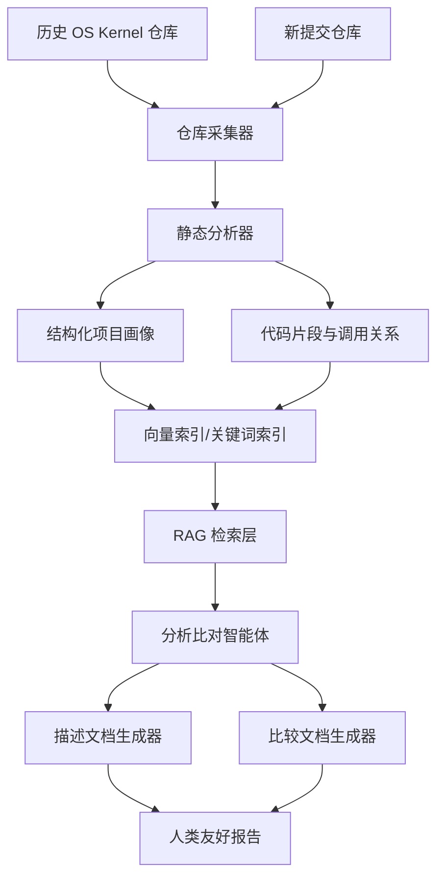

# KernelSage

面向小型操作系统的分析比对智能体系统设计

| 项目 | 内容 |
| --- | --- |
| 队名 | 干饭不想排队 |
| 成员 | 鲍灿辉、石雅禛 |
| 指导教师 | 王毅 |
| 学校 | 天津师范大学 |
| 学院 | 电子与通信工程学院 |
| 赛题 | proj18-面向小型操作系统的分析比对智能体系统设计 |
| 赛道 | 2026年全国大学生计算机系统能力大赛-操作系统设计赛(全国)-OS功能挑战赛道 |
| 赛题类型 | 学术型 |

## 1 目标描述

KernelSage 旨在构建一个面向小型操作系统源码仓库的智能体系统。系统围绕历届操作系统比赛 OS Kernel 赛道作品建立结构化知识库，对历史作品生成可读、可核验的描述文档，并将新提交作品与历史作品进行深度比对，输出面向评审和参赛者的比较文档。

系统重点解决三个问题：

1. 自动理解小型操作系统仓库的内核结构、模块划分、关键函数、系统调用、调度、内存管理、文件系统、驱动和同步机制等设计内容。
2. 对历史比赛作品进行统一格式的结构化描述，形成可追溯、可复核的项目画像。
3. 将新作品与历史作品进行语义级比对，识别相似设计、增量工作和创新点，降低简单文本匹配导致的误判。

## 2 赛题分析

赛题要求设计智能体对历史操作系统比赛内核赛道作品进行描述，并将新提交作品与历史作品进行比较。描述和比较结果都必须对人类友好，同时尽量避免大模型幻觉，比较文档应做到精准无误。

本项目将采用“静态分析 + RAG 检索 + 智能体工作流 + 人类可审计报告”的方案：

| 能力 | 实现思路 | 输出 |
| --- | --- | --- |
| 仓库结构分析 | 解析目录、构建语言分布和模块清单 | 项目结构摘要 |
| 代码语义抽取 | 提取函数、类型、调用关系、关键注释和配置 | 内核能力画像 |
| 历史作品索引 | 对历史仓库的结构化描述、代码片段和文档建立索引 | 可检索知识库 |
| 相似性比对 | 结合文本、AST、调用图和模块设计进行多维度比较 | 相似点与差异点 |
| 创新点归纳 | 从新增模块、实现路径、性能策略和设计差异中提炼 | 创新点分析文档 |
| 证据链输出 | 为每个判断关联源码路径、提交记录或文档片段 | 可复核报告 |

## 3 系统框架



核心模块规划：

| 模块 | 职责 |
| --- | --- |
| `collector` | 采集历史仓库、新提交仓库及 README、文档、提交历史等元数据 |
| `parser` | 识别源码语言、目录结构、配置文件和构建入口 |
| `analyzer` | 抽取函数、类型、模块、调用关系、系统调用实现和内核机制 |
| `indexer` | 建立结构化索引、关键词索引和向量索引 |
| `retriever` | 根据比较任务召回相关历史项目、代码片段和证据 |
| `agent` | 编排分析、检索、验证、比对和报告生成流程 |
| `reporter` | 输出项目描述文档、比较文档和可复核证据链 |

## 4 开发计划

| 阶段 | 时间 | 目标 | 关键产出 |
| --- | --- | --- | --- |
| 阶段一 | 第1周 | 完成仓库骨架和需求细化 | README、设计文档、目录规范 |
| 阶段二 | 第2-3周 | 实现仓库采集与静态结构分析 | 仓库元数据、目录树、语言统计 |
| 阶段三 | 第4-5周 | 实现代码语义抽取与索引 | 函数表、模块表、调用关系索引 |
| 阶段四 | 第6-7周 | 构建 RAG 与智能体比对工作流 | 初版描述/比较报告 |
| 阶段五 | 第8周 | 完善证据链、测试和演示材料 | 测试报告、Demo、最终文档 |

## 5 预期创新点

1. **面向 OS Kernel 的专用项目画像**：不只生成通用代码摘要，而是围绕进程管理、内存管理、系统调用、文件系统、同步原语、设备驱动等内核维度建立结构化描述。
2. **多维度比对机制**：结合目录结构、核心模块、函数调用、设计文档和提交历史，降低仅靠关键词或向量相似度造成的误判。
3. **证据链驱动的报告生成**：比较结论必须关联源码路径、函数名、文档段落或提交信息，便于评审复核。
4. **可插拔模型与检索后端**：优先适配国产、开源、免费模型，同时支持本地向量数据库或轻量级文件索引。

## 6 测试与评估

计划从以下维度评估系统：

| 指标 | 说明 |
| --- | --- |
| 描述准确性 | 生成的项目描述是否覆盖核心模块且没有明显幻觉 |
| 比较准确性 | 相似点、差异点和创新点是否能被源码证据支撑 |
| 可解释性 | 报告是否提供明确证据链，方便人工复核 |
| 泛化能力 | 是否能处理 RCore、UCore、微内核等不同风格作品 |
| 工程可复现性 | 是否提供清晰的依赖、脚本和示例数据 |

## 7 分工协作

| 成员 | 职责 |
| --- | --- |
| 鲍灿辉 | 智能体流程设计、代码分析模块、检索与比对实现 |
| 石雅禛 | 数据整理、报告模板、测试用例、文档撰写 |

## 8 仓库目录

```text
proj18-os-agent-compare/
|-- README.md
|-- LICENSE
|-- .gitignore
|-- docs/
|   |-- design.md
|   |-- report-template.md
|   `-- evaluation.md
|-- src/
|   `-- os_agent/
|       |-- __init__.py
|       |-- collector.py
|       |-- parser.py
|       |-- analyzer.py
|       |-- indexer.py
|       |-- retriever.py
|       |-- agent.py
|       `-- reporter.py
|-- scripts/
|   `-- .gitkeep
|-- data/
|   |-- samples/
|   |   `-- .gitkeep
|   `-- indexes/
|       `-- .gitkeep
|-- examples/
|   `-- .gitkeep
|-- tests/
|   `-- .gitkeep
`-- assets/
    `-- .gitkeep
```

## 9 当前状态

本仓库目前处于项目初始化阶段，已完成赛题信息整理、总体方案设计和目录规划。后续将逐步补充仓库采集、静态分析、索引检索、智能体编排和报告生成等功能。
