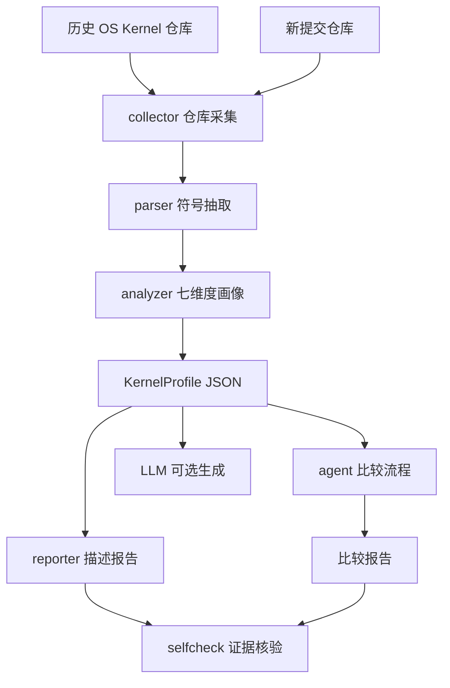

# KernelSage

面向小型操作系统的分析比对智能体系统设计。

| 项目 | 内容 |
| --- | --- |
| 队名 | 一定要以人类的身份赢啊 |
| 成员 | 鲍灿辉、石雅禛 |
| 指导教师 | 王毅 |
| 学校 | 天津师范大学 |
| 学院 | 电子与通信工程学院 |
| 赛题 | proj18-面向小型操作系统的分析比对智能体系统设计 |
| 赛道 | 2026 年全国大学生计算机系统能力大赛-操作系统设计赛 OS 功能挑战赛道 |
| 赛题类型 | 学术型 |

## 项目目标

KernelSage 旨在构建一个面向小型操作系统源码仓库的分析比对智能体。系统对历史 OS Kernel 作品建立结构化画像，为每个仓库生成可读、可核验的描述报告，并将新提交作品与历史样本进行多维度比较，辅助评审或参赛团队识别相似设计、差异点和可能创新点。

当前实现采用 MVP-first 路线：先保证“仓库扫描 -> 结构化画像 -> 证据检索 -> 描述报告 -> 比较报告 -> self-check”的闭环稳定可演示，再逐步增强 LLM 生成质量、历史样本规模和检索策略。

## 当前能力

已实现的 V1 能力：

- 本地仓库扫描：统计文件、语言、README/docs、构建入口等基础信息。
- 轻量符号抽取：对 Rust、C、汇编文件抽取函数、类型、impl 等符号定义。
- OS 维度分析：围绕调度、内存、系统调用、文件系统、同步、中断、驱动 7 个维度抽取证据片段。
- 结构化画像：生成 `KernelProfile` JSON，作为后续报告和比较的中间表示。
- 描述报告：生成带源码路径和行号证据的 Markdown 项目描述。
- 比较报告：将新仓库与历史样本进行多维度比较，输出相似点、差异点和可能创新点。
- 轻量 self-check：检查关键结论是否有证据、证据文件和行号是否有效。
- LLM 接入：支持 DeepSeek/OpenAI-compatible API、dry-run、缓存和失败回退。
- 端到端 demo：一条命令生成画像、描述报告和比较报告。

暂不作为 V1 必交付的能力：

- 完整调用图分析。
- 向量数据库和大规模 RAG。
- 自动化 golden benchmark。
- Web/HTML 可视化演示。

## 系统架构



核心模块：

| 模块 | 职责 |
| --- | --- |
| `collector` | 扫描仓库、读取文档、统计语言和构建入口 |
| `parser` | 抽取 Rust/C/Asm 符号定义 |
| `analyzer` | 基于关键词和路径优先级生成 OS 七维度画像 |
| `agent` | 编排新仓库与历史样本的比较逻辑 |
| `reporter` | 输出描述报告、比较报告和证据链 |
| `selfcheck` | 核验证据文件、行号和关键结论覆盖率 |
| `llm` | 接入 DeepSeek/OpenAI-compatible LLM、dry-run 和缓存 |
| `indexer` / `retriever` | V2 预留的检索扩展模块 |

## 快速运行

环境要求：

- Python 3.11+
- Git，用于拉取历史样本仓库
- V1 默认不依赖第三方 Python 包

拉取样本仓库：

```powershell
python scripts\fetch_repos.py
```

生成单个仓库画像和描述报告：

```powershell
python scripts\kernelsage.py describe data\samples\rcore-tutorial-v3 --repo-id rcore-tutorial-v3
```

批量生成样本描述报告：

```powershell
python scripts\kernelsage.py describe-all
```

生成比较报告：

```powershell
python scripts\kernelsage.py compare data\samples\rcore-tutorial-v3 --repo-id rcore-tutorial-v3 --limit 3
```

运行端到端 demo：

```powershell
python scripts\kernelsage.py demo data\samples\rcore-tutorial-v3 --repo-id rcore-tutorial-v3 --limit 2
```

默认输出：

- `data/profiles/*.json`：结构化 KernelProfile。
- `data/reports/describe/*.md`：项目描述报告。
- `data/reports/compare/*.md`：比较报告。
- `data/reports/prompts/*.prompt.md`：LLM dry-run 生成的 prompt。
- `data/llm_cache/`：LLM 响应缓存。

这些输出都是运行生成物，默认不提交到仓库。

## LLM 配置

默认命令不会调用 LLM API，也不会产生费用。只有显式传入 `--use-llm` 才会请求在线模型。

配置方式：

```powershell
copy .env.example .env
```

`.env` 示例：

```env
LLM_PROVIDER=deepseek
LLM_BASE_URL=https://api.deepseek.com/v1
LLM_MODEL=deepseek-chat
LLM_API_KEY=replace_with_your_new_api_key
```

安全约定：

- `.env` 已被 `.gitignore` 忽略，禁止提交真实 API Key。
- 优先使用 `--llm-dry-run` 检查 prompt，不调用 API。
- `--use-llm` 失败时会自动回退到规则版报告，保证流程可继续。
- LLM 响应会缓存到 `data/llm_cache/`，相同 prompt 不重复请求。

生成 prompt 但不调用 API：

```powershell
python scripts\kernelsage.py describe data\samples\rcore-tutorial-v3 --repo-id rcore-tutorial-v3 --llm-dry-run
python scripts\kernelsage.py compare data\samples\rcore-tutorial-v3 --repo-id rcore-tutorial-v3 --limit 2 --llm-dry-run
```

真实调用 LLM：

```powershell
python scripts\kernelsage.py describe data\samples\rcore-tutorial-v3 --repo-id rcore-tutorial-v3 --use-llm
```

## 证据与核验口径

报告末尾会输出 self-check 摘要：

- 关键结论数。
- 含证据关键结论数和覆盖率。
- 无效证据引用数。
- 未确认结论数。

统计口径：关键结论指需要源码证据支撑的设计判断，例如“包含系统调用分发逻辑”“实现页表/物理页管理”。语言构成、风格标签和汇总性描述不计入证据率，避免为了追求数字而给非判断性句子强行加引用。

## 仓库目录

```text
proj18-os-agent-compare/
|-- README.md
|-- DEVELOPMENT_LOG.md
|-- LICENSE
|-- pyproject.toml
|-- .env.example
|-- .gitignore
|-- docs/
|   |-- PLAN.md
|   |-- design.md
|   |-- evaluation.md
|   `-- report-template.md
|-- src/
|   `-- os_agent/
|       |-- __init__.py
|       |-- models.py
|       |-- collector.py
|       |-- parser.py
|       |-- analyzer.py
|       |-- agent.py
|       |-- reporter.py
|       |-- selfcheck.py
|       |-- llm.py
|       |-- indexer.py
|       |-- retriever.py
|       `-- cli.py
|-- scripts/
|   |-- fetch_repos.py
|   `-- kernelsage.py
|-- data/
|   |-- samples/
|   |   |-- manifest.json
|   |   `-- <repo_id>/
|   `-- indexes/
|       `-- .gitkeep
|-- assets/
|   `-- .gitkeep
|-- examples/
|   `-- .gitkeep
`-- tests/
    `-- .gitkeep
```

说明：

- `data/samples/<repo_id>/` 是本地拉取的历史样本仓库，默认不提交。
- `data/profiles/`、`data/reports/`、`data/llm_cache/` 是运行生成物，默认不提交。
- `.env` 是本地密钥配置文件，禁止提交。

## 研发计划

当前阶段重点围绕三周半赛程压缩交付：

| 优先级 | 任务 | 状态 |
| --- | --- | --- |
| P0 | MVP 静态分析闭环 | 已完成 |
| P0 | LLM dry-run、失败回退与缓存 | 已完成 |
| P0 | 端到端 demo 命令 | 已完成 |
| P0 | 轻量 self-check | 已完成 |
| P0 | 优化历史样本选择策略 | 进行中 |
| P0 | 接入可用 LLM API 试跑真实报告 | 待执行 |
| P1 | 改进关键词和文件优先级 | 待执行 |
| P1 | 整理答辩演示材料 | 待执行 |
| P2 | BM25/向量检索、调用图、HTML 展示 | 延后 |

研发过程记录见 [DEVELOPMENT_LOG.md](DEVELOPMENT_LOG.md)。

## 分工

| 成员 | 职责 |
| --- | --- |
| 鲍灿辉 | 智能体流程设计、代码分析模块、检索与比对实现 |
| 石雅禛 | 数据整理、报告模板、测试用例、文档撰写 |

## 当前状态

仓库已具备可演示的 V1 MVP：可以拉取历史样本，分析一个小型 OS 仓库，生成结构化画像、描述报告和比较报告，并给出证据核验摘要。下一步重点是优化历史样本选择和真实 LLM 报告效果。
