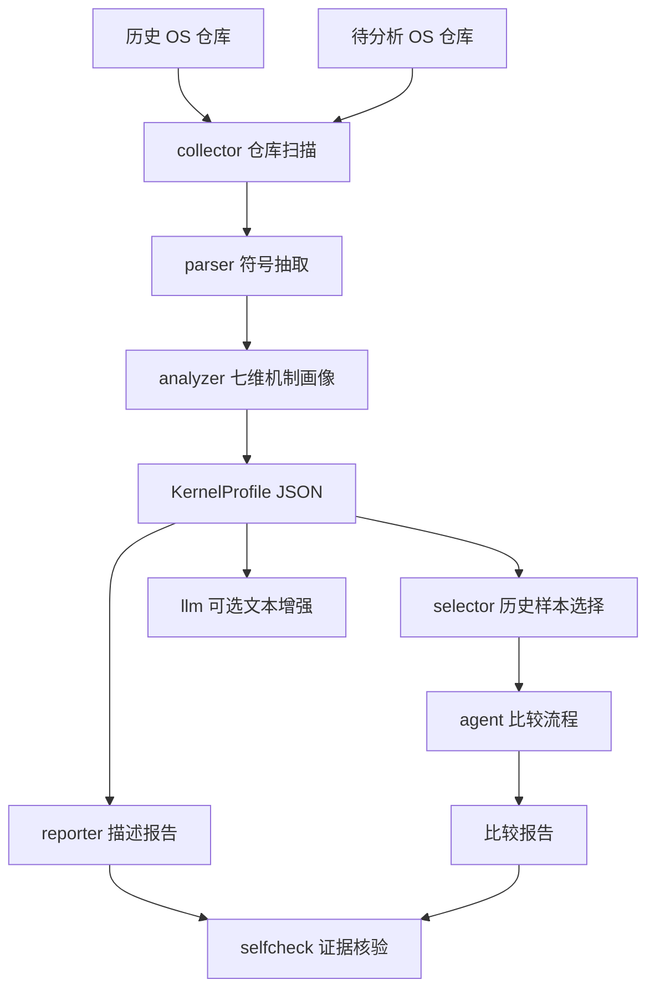

# KernelSage


面向小型操作系统仓库的分析比对智能体系统。KernelSage 接收一个 OS 源码仓库，生成结构化画像、证据链描述报告，并与历史参考库进行多维度比较，辅助评审或参赛团队识别相似设计、差异点和可能创新点。

## 项目卡片

| 项目 | 内容 |
| --- | --- |
| 队名 | 一定要以人类的身份赢啊 |
| 成员 | 鲍灿辉、石雅禛 |
| 指导老师 | 王毅 |
| 学校 | 天津师范大学 |
| 学院 | 电子与通信工程学院 |
| 赛题 | proj18-面向小型操作系统的分析比对智能体系统设计 |
| 赛道 | 2026 年全国大学生计算机系统能力大赛操作系统设计赛 OS 功能挑战赛道 |
| 赛题类型 | 学术型 |

## 当前状态

| 维度 | 状态 | 说明 |
| --- | --- | --- |
| MVP 闭环 | 已完成 | 仓库扫描、画像生成、报告生成、历史比较、self-check 已跑通 |
| 参考库 | 已扩展 | 18 个代表性样本，覆盖教学基线、比赛作品、RTOS、微内核、unikernel 等 |
| LLM 接入 | 已接入 | 支持 DeepSeek/OpenAI-compatible API、dry-run、缓存和失败回退 |
| 证据约束 | 已实现 | 报告保留源码路径和行号，关键结论进入 self-check |
| 测试回归 | 已补强 | 49 个 unittest 通过，覆盖 describe/compare E2E、LLM 审计、证据格式约束和报告抽查回归 |
| 演示材料 | 已整理 | 见 [docs/DEMO.md](docs/DEMO.md)、[docs/STAGE_REVIEW.md](docs/STAGE_REVIEW.md)、[docs/SHOWCASE_CASE.md](docs/SHOWCASE_CASE.md) 和 [docs/REPORT_AUDIT.md](docs/REPORT_AUDIT.md) |
| 下一重点 | 进行中 | golden 样例固定、答辩材料整理、获奖案例来源核验 |

## 系统做什么

```text
输入一个 OS 仓库
      |
      v
仓库扫描 + 符号抽取 + 七维 OS 机制分析
      |
      v
KernelProfile 结构化画像
      |
      +--> 描述报告：这个仓库实现了什么，有哪些源码证据
      |
      +--> 比较报告：它和历史样本像在哪里、差在哪里、哪些结论需要人工复核
      |
      v
self-check：证据是否存在，关键结论是否被支撑
```

## 核心能力

| 能力 | 当前实现 | 产出 |
| --- | --- | --- |
| 仓库采集 | 按 manifest 浅克隆历史样本仓库 | `data/samples/<repo_id>/` |
| 文件扫描 | 统计语言、目录、README/docs、构建入口 | `RepoSnapshot` |
| 符号抽取 | 轻量识别 Rust/C/Asm 函数、结构体、impl 等 | `Symbol` 列表 |
| OS 机制分析 | 调度、内存、系统调用、文件系统、同步、中断、驱动 7 维度 | `KernelProfile` |
| 样本选择 | 按风格、架构、语言、OS 维度和规模相似度排序 | Top N 历史样本 |
| 描述报告 | 按 OS 维度生成审阅卡片，包含摘要评分、结论、证据表、代码片段、相关符号和复核建议 | `data/reports/describe/*.md` |
| 比较报告 | 输出相似点、差异点、可能创新点和复核项 | `data/reports/compare/*.md` |
| 重合证据 | 单列“功能重合与疑似重复证据”，展示双方源码路径、行号和代码片段 | compare report |
| 代码级相似线索 | 检测文件路径、函数/符号名、结构体/宏名和片段 token/结构相似度，输出可复核线索但不裁定抄袭 | compare report |
| LLM 增强 | 可选生成更自然文本，默认不调用 API | `--use-llm` / `--llm-dry-run` |
| 摘要评分 | 基于已确认 OS 维度、构建入口和 self-check 生成成熟度等级，不调用 LLM | describe report |
| 证据核验 | 检查证据文件、行号和关键结论覆盖率 | self-check 摘要 |
| 画像缓存 | 复用历史样本 `KernelProfile`，降低 compare 重复分析成本 | `data/profiles/*.json` |

## 参考库覆盖

当前 `data/samples/manifest.json` 登记 18 个样本仓库。样本库不是追求“大而全”，而是优先覆盖主要技术路线，降低未知输入仓库比较时的偏置。

样本来源采用分级管理：没有官方获奖页面或可靠仓库来源时，不把任何样本硬标为“特奖/一等奖优秀案例”。

| 来源等级 | 样本 | 覆盖价值 |
| --- | --- | --- |
| `teaching_baseline` 教学基线 | rCore、uCore、xv6-riscv、zCore、ArceOS、rCore Book | 覆盖常见课程内核和现代 Rust OS 基线 |
| `competition_sample` 比赛作品样本 | `oskernel2024-hfut666`、`oskernel2024-aabcb`、`oskernel2024-nqos`、`oskernel2024-ouye` | 贴近真实学生参赛作品形态，但获奖等级未核验 |
| `architecture_reference` 架构参考样本 | `xv6-public`、`os-tutorial`、`littlekernel`、`freertos-kernel`、`tock`、`sel4`、`includeos`、`redox-kernel` | 补充 x86、ARM、RTOS、微内核、嵌入式内核、unikernel 等路线 |
| `verified_award` 已核验获奖案例 | 当前暂无 | 只有拿到官方获奖来源和可靠仓库链接后才加入 |

报告和 LLM prompt 都遵守该边界：未标注为 `verified_award` 的样本不能被称为特奖、一等奖或优秀获奖案例。

覆盖范围：

| 维度 | 已覆盖 |
| --- | --- |
| 语言 | Rust、C、C++、Assembly |
| 架构 | RISC-V、x86、x86_64、ARM |
| 内核形态 | 教学内核、比赛作品、RTOS、微内核、嵌入式内核、unikernel |

## 快速开始

环境要求：

| 工具 | 要求 |
| --- | --- |
| Python | 3.11+ |
| Git | 用于拉取历史样本 |
| 第三方 Python 包 | V1 默认不依赖 |

拉取参考样本：

```powershell
python scripts\fetch_repos.py
```

生成单个仓库画像和描述报告：

```powershell
python scripts\kernelsage.py describe data\samples\rcore-tutorial-v3 --repo-id rcore-tutorial-v3
```

生成比较报告：

```powershell
python scripts\kernelsage.py compare data\samples\rcore-tutorial-v3 --repo-id rcore-tutorial-v3 --limit 3
```

默认会复用 `data/profiles/` 下的 `KernelProfile` 缓存，避免每次比较都重新分析 18 个历史样本。源码仓库 HEAD、文件数量、总大小或修改时间变化时，缓存会自动失效。

```powershell
python scripts\kernelsage.py compare data\samples\xv6-public --repo-id xv6-public --limit 5
python scripts\kernelsage.py compare data\samples\xv6-public --repo-id xv6-public --limit 5 --rebuild-profile-cache
```

运行端到端演示：

```powershell
python scripts\kernelsage.py demo data\samples\rcore-tutorial-v3 --repo-id rcore-tutorial-v3 --limit 2
```

固定展示样例见 [docs/SHOWCASE_CASE.md](docs/SHOWCASE_CASE.md)，包含 `xv6-public` 稳定性样例和 `oskernel2024-aabcb` 比赛场景样例，可直接作为演示视频和答辩讲稿底稿。

运行测试：

```powershell
$env:PYTHONPATH='src'; python -m unittest discover -s tests
```

## 输出文件

| 路径 | 说明 | 是否提交 |
| --- | --- | --- |
| `data/profiles/*.json` | 结构化 KernelProfile | 否 |
| `data/reports/describe/*.md` | 描述报告 | 否 |
| `data/reports/compare/*.md` | 比较报告 | 否 |
| `data/reports/prompts/*.prompt.md` | LLM dry-run prompt | 否 |
| `data/llm_cache/` | LLM 响应缓存 | 否 |
| `data/samples/<repo_id>/` | 本地拉取的历史仓库源码 | 否 |

说明：报告和样本源码是运行生成物，当前会在本地保留供人工查看，但默认不提交到仓库。

## LLM 配置

默认命令不会调用 LLM API，也不会产生费用。只有显式传入 `--use-llm` 才会请求在线模型。

画像缓存不会调用 LLM，也不会增加 token 消耗。它只缓存本地静态分析结果，用来减少重复扫描、符号抽取和七维画像分析时间。token 成本只来自显式 `--use-llm` 的在线模型请求。

```powershell
copy .env.example .env
```

`.env` 示例：

```env
LLM_PROVIDER=deepseek
LLM_BASE_URL=https://api.deepseek.com/v1
LLM_MODEL=deepseek-chat
LLM_API_KEY=replace_with_your_new_api_key
```

安全约定：

| 规则 | 说明 |
| --- | --- |
| `.env` 不提交 | 真实 API Key 只保存在本地 |
| 优先 dry-run | `--llm-dry-run` 只生成 prompt，不调用 API |
| 失败回退 | `--use-llm` 失败时自动回退到规则版报告 |
| 缓存响应 | 相同 prompt 命中 `data/llm_cache/`，减少重复请求 |
| 输出审查 | `audit-llm-report` 本地检查 LLM 报告是否引用越界或越权判断 |

生成 prompt 但不调用 API：

```powershell
python scripts\kernelsage.py describe data\samples\rcore-tutorial-v3 --repo-id rcore-tutorial-v3 --llm-dry-run
python scripts\kernelsage.py compare data\samples\rcore-tutorial-v3 --repo-id rcore-tutorial-v3 --limit 2 --llm-dry-run
```

真实调用 LLM：

```powershell
python scripts\kernelsage.py describe data\samples\rcore-tutorial-v3 --repo-id rcore-tutorial-v3 --use-llm
python scripts\kernelsage.py compare data\samples\xv6-public --repo-id xv6-public --limit 3 --use-llm
```

审查 LLM 输出是否仍在 prompt evidence 边界内：

```powershell
python scripts\kernelsage.py audit-llm-report `
  --prompt data\reports\prompts\xv6-public.compare.prompt.md `
  --report data\reports\compare\xv6-public_vs_history.md
```

## 证据与边界

KernelSage 不把“看起来像”当作结论。报告末尾会输出 self-check 摘要：

| 指标 | 含义 |
| --- | --- |
| 关键结论数 | 需要源码证据支撑的判断性结论 |
| 证据覆盖率 | 带有效证据的关键结论占比 |
| 无效证据引用数 | 文件或行号不存在的证据引用 |
| 未确认结论数 | 系统主动保留给人工复核的结论 |

比较报告会区分“相似性”和“创新性”：

| 类型 | 处理方式 |
| --- | --- |
| 功能重合 | 单独列出双方命中的 OS 维度、证据路径、行号和代码片段 |
| 代码级相似线索 | 对文件路径、函数/符号名、结构体/宏名和 evidence 片段做轻量检测，只输出限量代表线索 |
| 相似性 | 基于已有样本和源码证据给出较明确结论 |
| 创新性 | 只在当前参考库范围内说明可能差异，不强行断言创新 |
| 代码级重复 | 不自动判定抄袭，只标注为需要结合完整代码和提交历史人工复核 |
| 覆盖不足 | 当样本库缺少同类项目时，降低结论置信度并提示人工复核 |
| 获奖标签 | 只有 `verified_award` 且带官方来源的样本才可称为获奖案例 |

## 系统架构



核心模块：

| 模块 | 职责 |
| --- | --- |
| `collector` | 扫描仓库、读取文档、统计语言和构建入口 |
| `parser` | 抽取 Rust/C/Asm 符号定义 |
| `analyzer` | 生成 OS 七维度画像和证据片段 |
| `selector` | 按画像相似度选择历史样本 |
| `agent` | 编排新仓库与历史样本比较流程 |
| `reporter` | 输出描述报告、比较报告和证据链 |
| `selfcheck` | 核验证据文件、行号和关键结论覆盖率 |
| `llm` | 接入 DeepSeek/OpenAI-compatible API、dry-run 和缓存 |
| `indexer` / `retriever` | V2 预留的检索扩展模块 |

## 仓库目录

```text
proj18-os-agent-compare/
|-- README.md
|-- DEVELOPMENT_LOG.md
|-- LICENSE
|-- pyproject.toml
|-- .env.example
|-- docs/
|   |-- PLAN.md
|   |-- DEMO.md
|   |-- SHOWCASE_CASE.md
|   |-- STAGE_REVIEW.md
|   |-- REPORT_AUDIT.md
|   |-- design.md
|   |-- evaluation.md
|   `-- report-template.md
|-- src/
|   `-- os_agent/
|       |-- collector.py
|       |-- parser.py
|       |-- analyzer.py
|       |-- selector.py
|       |-- agent.py
|       |-- reporter.py
|       |-- selfcheck.py
|       |-- llm.py
|       `-- cli.py
|-- scripts/
|   |-- fetch_repos.py
|   `-- kernelsage.py
|-- data/
|   |-- samples/
|   |   |-- manifest.json
|   |   `-- <repo_id>/
|   `-- indexes/
|       `-- .gitkeep
`-- tests/
    |-- test_e2e_cli.py
    |-- test_cli.py
    |-- test_analyzer.py
    |-- test_analyzer_evidence.py
    |-- test_collector.py
    |-- test_parser.py
    |-- test_profile_cache.py
    |-- test_reporter.py
    |-- test_similarity.py
    |-- test_llm_audit.py
    |-- test_llm_prompt.py
    |-- test_selector.py
    `-- test_selfcheck.py
```

## 研发路线

| 优先级 | 任务 | 状态 |
| --- | --- | --- |
| P0 | MVP 静态分析闭环 | 已完成 |
| P0 | LLM dry-run、失败回退和缓存 | 已完成 |
| P0 | 端到端 demo 命令 | 已完成 |
| P0 | 轻量 self-check | 已完成 |
| P0 | 历史样本选择策略 | 已完成 |
| P0 | 18 个代表性参考样本库 | 已完成 |
| P0 | 画像缓存复用，降低 compare 重复分析成本 | 已完成 |
| P1 | 新增样本报告人工抽查和关键词修正 | 已完成 |
| P1 | 答辩材料整理 | 进行中 |
| P2 | BM25/向量检索、调用图、HTML 展示 | 延后 |

演示流程见 [docs/DEMO.md](docs/DEMO.md)，固定展示样例见 [docs/SHOWCASE_CASE.md](docs/SHOWCASE_CASE.md)，阶段性评审材料见 [docs/STAGE_REVIEW.md](docs/STAGE_REVIEW.md)，研发过程记录见 [DEVELOPMENT_LOG.md](DEVELOPMENT_LOG.md)。

## 分工

| 成员 | 职责 |
| --- | --- |
| 鲍灿辉 | 智能体流程设计、代码分析模块、检索与比对实现 |
| 石雅禛 | 数据整理、报告模板、测试用例、文档撰写 |

## 当前结论

KernelSage 已具备可演示的 V1 MVP：能够拉取代表性历史样本，分析一个小型 OS 仓库，基于画像相似度选择对比样本，生成结构化画像、描述报告和比较报告，并给出证据核验摘要。当前版本重点强调“证据优先、边界清晰、可解释比较”，后续继续优化画像缓存、报告质量和答辩材料。
