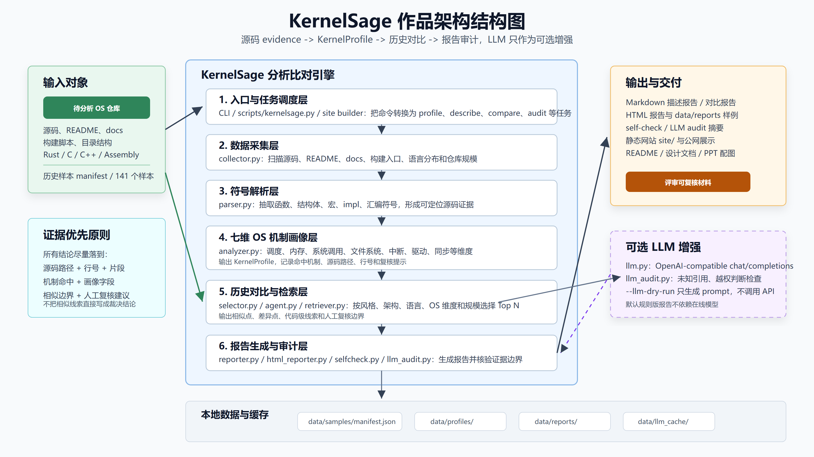
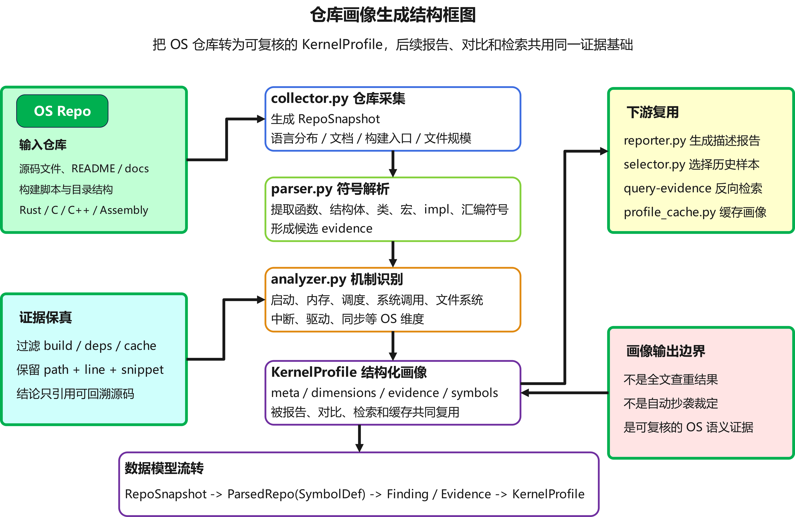
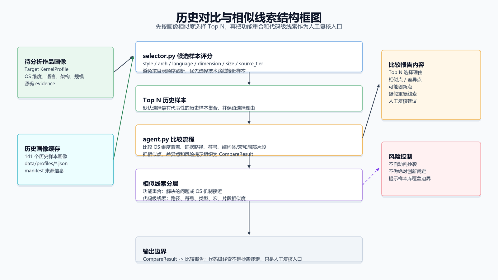
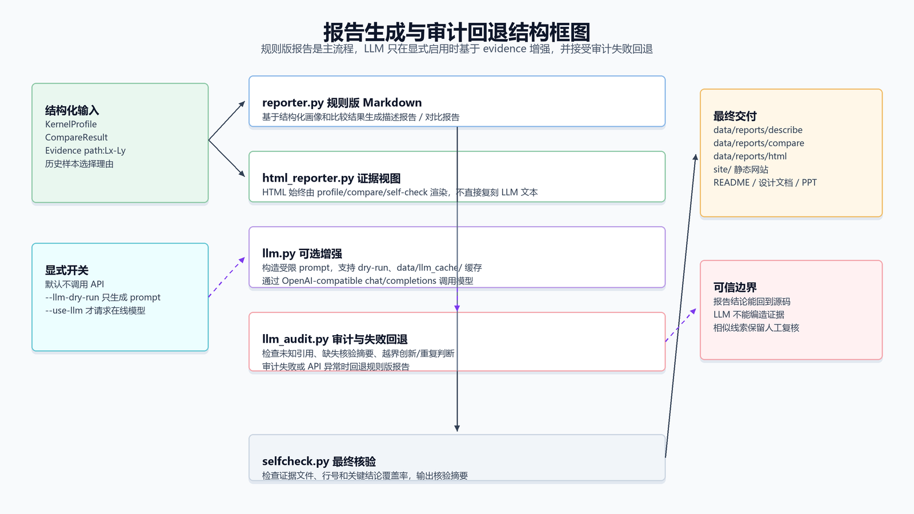
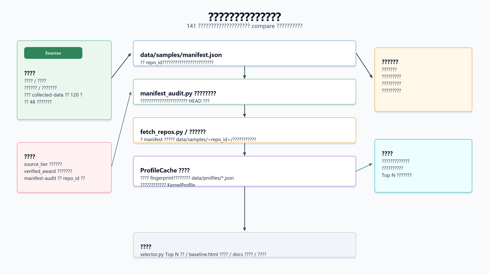

# KernelSage 设计技术文档

| 项目 | 内容 |
| --- | --- |
| 高校 | 天津师范大学 |
| 赛题编号 | proj18 |
| 赛题名称 | 面向小型操作系统的分析比对智能体系统设计 |
| 队伍名称 | 一定要以人类的身份赢啊 |
| 成员 | 鲍灿辉、石雅禛 |
| 指导老师 | 王毅 |
| 文档版本 | v2.0 |
| 文档用途 | 初赛设计技术文档，配合 README、操作手册、演示视频、网站和开源仓库审查使用 |

## 目录

- [1. 比赛准备和调研](#1-比赛准备和调研)
  - [1.1 项目目标描述](#11-项目目标描述)
  - [1.2 赛题理解与评审场景](#12-赛题理解与评审场景)
  - [1.3 历史样本与开源资料调研](#13-历史样本与开源资料调研)
  - [1.4 相关技术调研与路线取舍](#14-相关技术调研与路线取舍)
- [2. 系统框架和模块设计](#2-系统框架和模块设计)
  - [2.1 总体架构](#21-总体架构)
  - [2.2 入口与任务调度层](#22-入口与任务调度层)
  - [2.3 数据采集与仓库画像层](#23-数据采集与仓库画像层)
  - [2.4 历史样本选择与相似线索层](#24-历史样本选择与相似线索层)
  - [2.5 LLM 增强、报告审计与回退层](#25-llm-增强报告审计与回退层)
  - [2.6 网站展示与部署层](#26-网站展示与部署层)
  - [2.7 核心数据结构与模块映射](#27-核心数据结构与模块映射)
- [3. 开发计划](#3-开发计划)
  - [3.1 阶段一：MVP 仓库分析闭环](#31-阶段一mvp-仓库分析闭环)
  - [3.2 阶段二：LLM 可控接入和证据核验](#32-阶段二llm-可控接入和证据核验)
  - [3.3 阶段三：历史样本选择和代码相似线索](#33-阶段三历史样本选择和代码相似线索)
  - [3.4 阶段四：样本扩展、网站发布和提交材料收敛](#34-阶段四样本扩展网站发布和提交材料收敛)
  - [3.5 风险与回退计划](#35-风险与回退计划)
- [4. 比赛过程中的重要进展](#4-比赛过程中的重要进展)
  - [4.1 阶段时间线](#41-阶段时间线)
  - [4.2 从单仓库分析扩展为历史作品比对](#42-从单仓库分析扩展为历史作品比对)
  - [4.3 从 Top 3 对比扩展到 Top 5 对比](#43-从-top-3-对比扩展到-top-5-对比)
  - [4.4 历史基线库扩展到 141 个样本](#44-历史基线库扩展到-141-个样本)
  - [4.5 建立可公开访问的网站](#45-建立可公开访问的网站)
  - [4.6 系统测试和质量验证](#46-系统测试和质量验证)
- [5. 遇到的主要问题和解决方法](#5-遇到的主要问题和解决方法)
  - [5.1 历史仓库来源复杂，部分仓库无法 clone](#51-历史仓库来源复杂部分仓库无法-clone)
  - [5.2 样本来源分级不清，容易造成获奖信息误用](#52-样本来源分级不清容易造成获奖信息误用)
  - [5.3 关键字匹配容易误判 OS 机制](#53-关键字匹配容易误判-os-机制)
  - [5.4 C++、unikernel、RTOS 等非典型内核覆盖不足](#54-cunikernelrtos-等非典型内核覆盖不足)
  - [5.5 功能重合和代码相似边界不清](#55-功能重合和代码相似边界不清)
  - [5.6 LLM 输出存在幻觉和越界判断风险](#56-llm-输出存在幻觉和越界判断风险)
  - [5.7 大样本库重复分析耗时](#57-大样本库重复分析耗时)
  - [5.8 本地演示网站无法被评委直接访问](#58-本地演示网站无法被评委直接访问)
- [6. 作品特征描述](#6-作品特征描述)
  - [6.1 源码证据链优先](#61-源码证据链优先)
  - [6.2 七维 OS 机制画像](#62-七维-os-机制画像)
  - [6.3 分层历史样本库](#63-分层历史样本库)
  - [6.4 可控 LLM 增强](#64-可控-llm-增强)
  - [6.5 HTML 证据报告和 query-evidence 检索](#65-html-证据报告和-query-evidence-检索)
  - [6.6 本地优先和可复现交付](#66-本地优先和可复现交付)
- [7. 分工和协作](#7-分工和协作)
  - [7.1 团队信息](#71-团队信息)
  - [7.2 工作分工](#72-工作分工)
  - [7.3 协作流程](#73-协作流程)
  - [7.4 质量协作方式](#74-质量协作方式)
- [8. 提交仓库目录和文件描述](#8-提交仓库目录和文件描述)
  - [8.1 核心目录](#81-核心目录)
  - [8.2 数据和报告目录](#82-数据和报告目录)
  - [8.3 文档和演示目录](#83-文档和演示目录)
  - [8.4 网站与公开展示目录](#84-网站与公开展示目录)
  - [8.5 未直接提交的大体积本地数据](#85-未直接提交的大体积本地数据)
- [9. 比赛收获](#9-比赛收获)
  - [9.1 对操作系统作品分析的理解](#91-对操作系统作品分析的理解)
  - [9.2 对智能体工程边界的理解](#92-对智能体工程边界的理解)
  - [9.3 对工程交付的理解](#93-对工程交付的理解)
  - [9.4 对后续改进方向的认识](#94-对后续改进方向的认识)

## 1. 比赛准备和调研

### 1.1 项目目标描述

KernelSage 的目标是设计并实现一套面向小型操作系统仓库的分析比对智能体。系统接收一个 OS 源码仓库后，自动扫描代码结构，抽取 OS 机制证据，生成结构化画像，并与历史比赛作品、教学内核和架构参考项目进行对比，最终输出人类可读、证据可复核的描述报告和比较报告。

项目目标可以拆成六项：

1. 构建仓库静态分析能力：读取源码、README、文档、构建脚本和目录结构，识别语言分布、核心文件和项目形态。
2. 构建 OS 机制画像：围绕启动、内存、调度、系统调用、文件系统、中断、驱动、同步等机制形成结构化判断。
3. 建立历史样本基线库：将可本地复核的历史作品、教学基线和参考项目纳入 manifest 管理，并为每个样本独立构建画像。
4. 生成证据链报告：报告中的关键结论尽量绑定源码路径、行号、代码片段和符号，便于评委回到仓库人工复核。
5. 支持受控 LLM 增强：LLM 只作为可选文本增强组件，不能绕过证据链直接裁定创新、重复或抄袭。
6. 完成可演示交付：提供命令行、报告样例、公开网站、操作手册和设计文档，满足初赛开源仓库审查和视频演示要求。

### 1.2 赛题理解与评审场景

赛题的核心不是重新实现一个操作系统，而是构建一个能够分析小型 OS 仓库、描述其技术特征、并与历史作品进行比较的智能体系统。对评委而言，系统需要回答三个问题：

- 输入仓库实现了哪些 OS 机制，证据在哪里；
- 它与哪些历史作品或教学基线相近，相近的依据是什么；
- 哪些内容属于合理的技术路线共性，哪些线索需要人工进一步复核。

因此，本项目把“证据优先、边界清晰、可复核”作为设计底线。KernelSage 不直接替代评委做最终裁决，也不把相似线索写成抄袭结论，而是将仓库画像、历史样本、相似证据和风险提示整理成可检查材料。

### 1.3 历史样本与开源资料调研

项目调研了往届操作系统比赛作品、教学内核、架构参考项目和赛事组提供的 collected-data 样本。现有历史基线库坚持本地可复现原则，只把能够成功 clone 或已经验证可用的仓库纳入正式样本清单。

当前样本库共包含 141 个历史样本，其中包括已验证代表作品、教学基线、架构参考项目，以及从赛事组 collected-data 中成功拉取的 120 个历史作品。赛事组 collected-data 原始记录为 168 条，其中 48 条因为仓库不可访问、认证限制、地址失效或网络拉取失败等原因未纳入正式本地基线库，并在导入说明中保留失败记录，避免在演示和评审中混淆样本来源。

这些样本不是合并成一个“大仓库”做文本查重，而是逐个仓库构建画像。后续输入比赛作品时，系统会根据架构、语言、规模、OS 机制覆盖度和功能相似度选择相近历史样本进行 Top N 对比。

### 1.4 相关技术调研与路线取舍

围绕赛题，本项目重点调研并取舍了四类技术路线：

| 方向 | 可用能力 | 取舍结果 |
| --- | --- | --- |
| 传统关键词搜索 | 实现简单，适合快速定位文件和片段 | 单独使用容易误判，因此只作为证据候选来源之一 |
| AST/符号解析 | 能识别函数、结构体、宏、模块等代码结构 | 当前采用轻量解析，覆盖 Rust/C/C++/Assembly，暂不做完整跨文件调用图 |
| 通用代码查重 | 能发现文本或 token 相似片段 | 与 OS 机制画像结合使用，避免把领域共性直接当成重复 |
| LLM 报告生成 | 适合组织复杂信息和生成自然语言 | 只做可选增强，必须受证据、缓存、审计和失败回退约束 |

最终路线是“静态仓库分析 + OS 语义画像 + 历史样本检索 + 代码级相似线索 + 可选 LLM 增强”。这种路线兼顾可运行、可解释和可演示，适合初赛阶段的开源仓库审查。

## 2. 系统框架和模块设计

### 2.1 总体架构

KernelSage 按分层方式设计，整体数据流如下。技术手册内嵌的结构框图与 README 保持一致，并优先使用 PNG 文件，便于后续转换为 PDF：



该结构图位于 `assets/kernelsage-architecture.png`，单页 PPTX 位于 `assets/kernelsage-architecture-slide.pptx`，可用于答辩材料。

```text
输入仓库 / 历史样本 manifest
        |
        v
入口与任务调度层：CLI、脚本、网站构建任务
        |
        v
数据采集层：源码、README、docs、构建入口、语言分布
        |
        v
画像分析层：符号抽取、OS 机制识别、KernelProfile
        |
        v
历史对比层：样本选择、相似度评分、代码级线索
        |
        v
报告生成层：Markdown、HTML、LLM 增强、self-check 审计
        |
        v
展示交付层：data/reports、site、公开网站、操作手册
```

这种分层参考了成熟技术文档常用的“目标、框架、计划、进展、测试、问题、交付”组织方式，但具体模块完全围绕本项目的 OS 仓库分析比对场景设计。

从工程视角看，这个架构的核心不是单个模型调用，而是一条可复核的数据流水线。输入端接收待分析仓库或历史样本 manifest；中间层把源码、文档、构建脚本和符号抽取结果逐步转换为 `RepoSnapshot`、`SymbolDef`、`KernelProfile` 等结构化对象；输出端再基于这些结构化对象生成 Markdown、HTML、对比报告和网站页面。每一层都保留中间产物，便于定位问题，也便于在演示时解释“系统为什么得出这个结论”。

分层设计还解决了两个比赛评审场景中的现实问题。第一，评委需要看到证据来源，而不只是自然语言总结，因此报告生成层不能直接跳过采集和画像层。第二，历史样本规模会不断扩展，如果所有能力耦合在一个脚本里，后续添加样本、调整相似度权重或替换 LLM 服务都会影响主流程稳定性。KernelSage 把仓库扫描、画像分析、历史选择、报告生成和网站展示拆开，使每一层可以独立测试、独立回退。

系统主流程可以概括为“先形成事实，再组织表达”。事实部分由本地静态分析完成，包括文件列表、语言分布、符号定义、OS 机制证据、样本来源和相似度分数；表达部分由规则报告和可选 LLM 增强完成。这样即使在线模型不可用，系统仍能完成画像、比较和证据展示；即使启用 LLM，LLM 也只能围绕已经给出的 evidence 进行归纳，而不能成为事实来源。

### 2.2 入口与任务调度层

入口层主要由 `scripts/kernelsage.py` 和 `src/os_agent/cli.py` 组成，负责把用户命令转换为具体任务。主要命令包括：

| 命令 | 功能 |
| --- | --- |
| `profile` | 为单个仓库生成结构化画像 |
| `describe` | 生成单仓库描述报告，可选 HTML 和 LLM |
| `compare` | 将输入仓库与历史样本库进行 Top N 对比 |
| `describe-all` | 批量生成历史样本描述结果 |
| `manifest-audit` | 检查样本库来源、repo_id、安全边界和本地完整性 |
| `query-evidence` | 根据“调度器/页表/系统调用”等概念检索源码证据 |
| `audit-llm-report` | 审计 LLM 生成报告是否越界引用或过度断言 |

入口层的设计原则是显式开关。默认命令不调用在线模型，不访问网络；只有用户显式传入 `--use-llm` 或执行拉取样本命令时，才会触发外部资源。

入口层同时承担“演示路径稳定”和“功能边界清晰”的责任。`profile` 面向单仓库画像，适合说明系统如何理解一个 OS 项目；`describe` 面向单仓库描述报告，适合展示证据链；`compare` 面向比赛查重和横向比较，适合说明输入作品与历史样本之间的关系；`manifest-audit` 和 `query-evidence` 则用于回答评委可能追问的“样本来源是否可信”和“证据能否反查”。这些命令组合起来，覆盖了从开发调试到初赛演示的主要使用场景。

CLI 的参数设计尽量避免隐式副作用。例如 `--html` 明确表示额外生成静态证据页面，`--jobs` 明确表示并行处理历史样本，`--top-n` 明确控制对比样本数量，`--llm-dry-run` 只写出 prompt 不访问 API。这种设计使演示人员可以解释每一个开关的影响，也能在网络、API 或样本目录异常时快速切换到本地规则版流程。

任务调度层还负责把生成物放到稳定目录中：画像进入 `data/profiles/`，Markdown 报告进入 `data/reports/`，HTML 证据页面进入 `data/reports/html/` 或 `site/`。稳定路径降低了后续网站构建、演示视频录制和提交材料整理的成本，也避免不同命令各自散落输出文件。

### 2.3 数据采集与仓库画像层

`collector.py` 负责扫描仓库文件、README、文档、构建脚本和 manifest 元数据，形成 `RepoSnapshot`。采集时会过滤常见低价值目录，避免把构建产物、依赖目录或缓存目录误当成核心实现。

`parser.py` 负责从 Rust、C、C++ 和 Assembly 文件中抽取函数、结构体、类、宏、模块声明和汇编符号。小型 OS 仓库经常混合多种语言，尤其是启动、trap、驱动和平台适配代码中常见 C/ASM 混合，因此符号抽取不能只面向单一语言。



以下局部结构图均有同名 PNG 位于仓库根目录的 `assets/`，四页汇总 PPTX 位于 `assets/kernelsage-module-architecture-slides.pptx`，可直接用于答辩 PPT。

仓库画像生成是本作品的核心能力之一。它不是简单统计“有多少 C 文件、多少 Rust 文件”，而是先把仓库拆成可分析的事实单元，再围绕 OS 机制组织这些事实。`collector.py` 负责回答“仓库里有什么”，`parser.py` 负责回答“源码里有哪些符号和结构”，`analyzer.py` 负责回答“这些符号和片段是否能支撑某个 OS 机制判断”。三者分离后，后续如果发现某个维度误判，可以定位到采集过滤、符号解析或机制规则中的具体一层。

采集阶段会主动过滤构建产物、依赖目录、缓存目录和大体积无关文件。这样做的原因是操作系统仓库经常包含镜像、工具链缓存、第三方库或实验输出，如果不加区分地扫描，语言统计和证据检索会被噪声放大。对于 README、docs、Makefile、Cargo.toml、linker script 等文件，系统会保留它们作为项目形态和构建入口证据，因为这些文件往往能说明内核启动方式、目标架构和运行环境。

解析阶段采用轻量符号抽取，而不是构建完整编译级 AST。这个取舍来自比赛场景：历史样本来自不同年份、不同语言和不同构建系统，很多项目未必能在评审机器上完整编译。轻量解析不依赖编译环境，能够覆盖 Rust、C、C++ 和 Assembly 的函数、结构体、宏、模块和汇编符号，足以支撑仓库画像、报告证据和相似线索初筛。

`analyzer.py` 将采集结果转换为 `KernelProfile`。画像围绕 OS 机制组织，核心判断包括：

| 维度 | 典型证据 |
| --- | --- |
| 启动与引导 | boot、entry、linker script、trap vector、platform init |
| 内存管理 | page table、allocator、mmap、frame、heap、VM area |
| 任务调度 | task、process、thread、scheduler、context switch |
| 系统调用 | syscall table、trap dispatch、用户态入口、兼容层 |
| 文件系统 | inode、block、vfs、fat、fs driver、buffer cache |
| 中断与异常 | interrupt、trap、irq、PLIC、IDT、exception handler |
| 驱动与设备 | UART、virtio、block、console、timer、network、platform device |
| 同步机制 | spinlock、mutex、semaphore、atomic、wait queue |

画像判断会尽量区分“确认存在”“存在弱线索”和“未确认”。例如文件中出现 `sched` 字样只能说明可能存在任务调度相关线索；如果同时出现调度队列、上下文切换、任务控制块或时间片处理，才能形成更强的调度证据。类似地，系统调用维度需要结合 trap 分发、系统调用号、用户态入口和处理函数；文件系统维度需要结合 inode、block、VFS 或具体驱动代码，而不是只看到 `fs` 目录就直接确认完整文件系统实现。

`KernelProfile` 的价值在于把不同类型仓库归一到同一套可比较结构中。无论输入项目是 xv6/rCore 类教学内核、RTOS、unikernel，还是比赛队伍自研内核，系统都会用同一份画像对象保存语言、架构、风格、构建入口、OS 维度和证据列表。后续描述报告、历史样本选择、相似度评分和 HTML 展示都复用这份画像，避免不同模块各自做一套不一致的判断。

### 2.4 历史样本选择与相似线索层

历史对比层由 `selector.py`、`agent.py` 和相似线索逻辑组成。系统不会按目录顺序随意选取历史样本，而是综合以下因素排序：

- 项目风格是否接近，例如 teaching-monolithic、microkernel、RTOS、unikernel；
- 架构是否接近，例如 RISC-V、x86、AArch64 或多架构；
- 语言构成是否接近，例如 Rust/C/C++/Assembly 占比；
- OS 机制覆盖度是否接近；
- 代码规模和目录结构是否接近；
- 样本来源是否可信，是否有明确 manifest 记录。



相似线索分为两层：功能相似和代码级相似。功能相似说明两个 OS 项目解决的问题或机制相近；代码级相似进一步检查路径、函数或符号、结构体/类型、宏和局部片段 token/结构相似度。报告会明确这些线索只是人工复核入口，不是自动裁定。

历史样本选择不是为了找“最像的名字”，而是为了找最有复核价值的参照对象。选择器会综合项目风格、架构、语言构成、OS 机制覆盖度和代码规模。比如一个 RISC-V Rust 教学内核更应该优先和 rCore、xv6-riscv 或同类比赛作品比较，而不是和一个 ARM RTOS 或 C++ unikernel 直接比较。这样可以减少无意义对比，让 Top N 样本更贴近评委需要复核的技术路线。

代码级相似线索采用保守策略。路径相似、函数名相似或宏名相似只能作为入口，不直接形成结论；片段相似度同时参考 token 交集和结构形态，只有超过阈值才进入 review leads。报告中会保留相似片段所在路径、行号和简短代码片段，便于人工回到两个仓库中检查上下文。系统特别避免使用“抄袭”“侵权”等裁定性表述，因为这些结论需要提交历史、完整实现、队伍说明和人工复核共同支持。

对比赛而言，这一层的意义是把“大量历史仓库”压缩成“少量值得看的候选样本”。评委不需要从 141 个样本中手工筛选，也不需要相信一个黑盒分数；系统会说明为什么选择这些样本、相似在哪里、差异在哪里、哪些线索需要进一步看源码。

### 2.5 LLM 增强、报告审计与回退层

`llm.py` 提供 DeepSeek/OpenAI-compatible API 调用能力，`llm_audit.py` 负责审计 LLM 输出。系统默认使用规则版报告，不消耗在线 API；启用 LLM 时，prompt 会包含已经抽取的证据、历史样本选择理由和边界要求。



为了避免幻觉，系统设置了四道约束：

1. 显式调用：必须使用 `--use-llm` 才会请求在线模型。
2. Dry-run：`--llm-dry-run` 只生成 prompt，不调用 API。
3. 缓存：LLM 响应按 prompt hash 缓存，避免重复扣费。
4. 审计与回退：报告引用未知文件、缺失核验摘要或越界确认创新点时，自动回退规则报告。

LLM 增强层的输入不是裸仓库，而是已经整理好的画像、证据和比较结果。prompt 中会明确列出允许引用的文件、行号和样本来源，并要求模型只能基于这些内容组织报告。这样可以利用 LLM 的语言组织能力，但不让它绕过本地分析直接“猜测”实现细节。

审计与回退机制是这一层的关键。系统会检查 LLM 报告是否引用了 prompt 中不存在的源码位置，是否缺失 self-check 摘要，是否把“相似线索”写成确定裁定，是否越权称普通样本为获奖案例。一旦审计失败，CLI 会自动回退到规则版报告。对评审场景来说，这比单纯追求自然语言流畅更重要，因为提交材料必须可复核、可解释、可稳定复现。

因此，LLM 在 KernelSage 中不是“智能体的全部”，而是报告层的可选增强模块。本地规则分析负责事实，LLM 负责在证据范围内改善表达。这个边界能降低 API 不稳定、模型幻觉和费用消耗对作品主流程的影响。

### 2.6 网站展示与部署层

网站部分位于 `site/`，通过静态页面展示项目介绍、历史基线库、报告样例和操作入口说明。`scripts/build_site.py` 根据当前数据生成网站页面，`scripts/serve_site.py` 用于本地预览。

由于初赛要求提供可访问的网站链接，项目已将静态网站部署到阿里云 ECS，并通过 Nginx 暴露公网访问：

- 项目首页：`http://47.114.95.237/`
- 历史基线库页面：`http://47.114.95.237/baseline.html`

静态网站的价值在于降低评委查看门槛。评委不需要在本地安装 Python，也能先通过网页了解项目目标、样本库和演示材料。

网站展示层并不替代命令行工具，而是把命令行生成的结果转换成更适合评审浏览的入口。首页用于说明项目目标、使用场景和核心流程；历史基线库页面用于展示样本来源和数量；报告页面用于展示单仓库画像、历史对比、自检结果和证据片段。这样评委可以先通过网站形成整体认识，再按需要回到 README、操作手册或源码中复核。

网站采用静态化方式发布，原因是初赛交付更关注可访问性和稳定性，而不是在线交互复杂度。静态页面可以由 `scripts/build_site.py` 从本地数据重新生成，部署时只需要 Nginx 提供文件服务，不需要额外数据库或后端进程。即使服务器资源较小，也能稳定承载评委访问。

### 2.7 核心数据结构与模块映射

| 数据结构 / 模块 | 责任 | 主要产出 |
| --- | --- | --- |
| `RepoSnapshot` | 仓库扫描结果，包含文件、语言、README、构建入口 | 输入给解析器和分析器 |
| `SymbolDef` | 轻量符号定义，记录名称、类型、路径和行号 | 支撑 OS 机制识别和相似线索 |
| `KernelProfile` | 单个仓库的 OS 画像 | 描述报告、历史选择、比较报告 |
| `Evidence` | 证据文件、行号、片段和解释 | 报告证据链和 self-check |
| `CompareResult` | 输入仓库与历史样本的比较结果 | 相似点、差异点、代码级线索 |
| `ProfileCache` | 本地画像缓存 | 加速 141 个历史样本复用 |
| `ManifestAuditor` | 样本库可信度检查 | 发现 repo_id、来源、奖项和本地路径问题 |

这些核心数据结构形成了本项目的内部契约。`RepoSnapshot` 和 `SymbolDef` 偏向事实采集，`KernelProfile` 偏向领域解释，`CompareResult` 偏向横向比较，`Evidence` 贯穿所有报告输出，`ProfileCache` 和 `ManifestAuditor` 则保证大样本库可复用、可信。通过这些结构，系统可以把一次分析拆成多个可测试环节，而不是把扫描、判断和写报告混在同一个函数里。

这种数据结构设计也便于后续扩展。例如如果后续加入更强的 AST 解析，只需要增强 `SymbolDef` 的来源和字段；如果增加新的 OS 机制维度，只需要扩展 `KernelProfile.dimensions` 和 analyzer 规则；如果历史样本继续增长，`ProfileCache` 和 selector 可以继续复用现有画像，不必重写报告生成层。

## 3. 开发计划

### 3.1 阶段一：MVP 仓库分析闭环

第一阶段目标是形成可运行的最小闭环：仓库采集、结构化画像、描述报告和基础比较报告。该阶段优先保证系统能对一个本地 OS 仓库产生稳定输出。

验收标准：

- 能扫描源码、README、docs 和构建入口；
- 能识别 Rust/C/Assembly 的基础符号，后续扩展 C++；
- 能生成 `KernelProfile`；
- 能输出 Markdown 描述报告；
- 能选择少量历史样本并生成对比报告。

### 3.2 阶段二：LLM 可控接入和证据核验

第二阶段目标是接入 LLM，但不让 LLM 成为不受控的裁判。系统需要支持 `.env` 本地配置、dry-run、缓存、失败回退和报告审计。

验收标准：

- 默认命令不调用在线模型；
- `.env` 和 `data/llm_cache/` 不进入仓库；
- `describe` 和 `compare` 均支持 LLM dry-run；
- 报告生成后有 self-check 核验摘要；
- LLM 失败或审计不通过时仍能输出规则版报告。

### 3.3 阶段三：历史样本选择和代码相似线索

第三阶段目标是提升比较报告质量。系统需要避免按目录顺序选样本，改为根据画像相似度选择更合理的历史基线。

验收标准：

- `selector.py` 根据风格、架构、语言、维度和规模评分；
- compare 报告展示历史样本选择理由；
- 代码级相似线索覆盖路径、符号、结构体/类型、宏和片段结构；
- 报告明确说明相似线索不等于抄袭裁定。

### 3.4 阶段四：样本扩展、网站发布和提交材料收敛

第四阶段围绕初赛交付展开。重点任务包括导入 collected-data、构建 141 个样本画像缓存、更新网站基线库、整理操作手册、固定演示案例和补齐设计技术文档。

验收标准：

- `data/samples/manifest.json` 记录 141 个可复核样本；
- `docs/COLLECTED_DATA_IMPORT.md` 记录 168 条原始数据中的成功和失败情况；
- 网站公开访问并展示最新基线库；
- README、操作手册、设计文档和报告样例互相指向；
- GitLab 和 GitHub 远端保持同步。

### 3.5 风险与回退计划

| 风险 | 回退方案 |
| --- | --- |
| LLM API 不可用或余额不足 | 使用规则版报告，LLM 只作为可选增强 |
| 历史样本仓库无法访问 | 只纳入成功 clone 的样本，失败项写入导入说明 |
| 关键词误判 OS 机制 | 通过路径 token、符号过滤、低优先级目录过滤和人工抽查规则收敛 |
| 大样本库分析耗时 | 预构建 ProfileCache，后续输入仓库只读取历史画像缓存 |
| 公网网站无法访问 | 静态网站可本地预览，必要时重新部署 Nginx 目录 |
| 相似线索被误解为裁定 | 报告、README 和设计文档都保留人工复核边界 |

## 4. 比赛过程中的重要进展

### 4.1 阶段时间线

| 时间 | 关键进展 | 验证或产出 |
| --- | --- | --- |
| 2026-05-29 | 完成 MVP 仓库分析闭环 | `collector/parser/analyzer/reporter/agent/cli` 主流程跑通 |
| 2026-05-29 | 接入 LLM 客户端基础设施 | 支持 `.env`、`--use-llm`、`--llm-dry-run`、缓存和失败回退 |
| 2026-06-05 | 完成 demo 命令和 self-check | 报告末尾加入证据核验摘要 |
| 2026-06-06 | 优化历史样本选择策略 | `selector.py` 不再按目录顺序截断历史仓库 |
| 2026-06-11 | 完成报告人工抽查规则收口 | 修正 C++ 覆盖、宏注释误判、路径子串误判和 syscall stub 过度解读 |
| 2026-06 中旬 | 固定展示案例和 golden 校准样例 | `xv6-public` 描述样例和 `oskernel2024-aabcb` 对比样例 |
| 2026-06 下旬 | 导入 collected-data 并扩展基线库 | 141 个历史样本，120 个来自赛事组 collected-data 成功 clone 项 |
| 2026-06 下旬 | 部署公开网站并整理提交文档 | 网站、操作手册、设计技术文档、报告样例和 README 形成闭环 |

### 4.2 从单仓库分析扩展为历史作品比对

项目早期重点是单仓库描述，后来扩展为“输入作品 vs 历史样本库”的比较模式。这样报告不只说明当前仓库内部实现情况，还能把它放到往届作品、教学基线和架构参考项目中横向定位。

以 `oskernel2024-aabcb` 这类输入作品为例，系统会先为输入仓库构建画像，再与历史样本库中相近项目进行对比，输出相似点、差异点、代码级线索和人工复核建议。

### 4.3 从 Top 3 对比扩展到 Top 5 对比

为了让比较结果更充分，系统将历史样本对比数量从 Top 3 扩展到 Top 5。这样可以减少偶然样本对结论的影响，让报告覆盖更多相近实现路线。

同时系统明确 API 消耗边界：如果只使用本地静态分析和已经构建好的画像缓存，Top 5 不会增加 LLM API 消耗；只有显式启用 LLM，并要求 LLM 分析更多历史样本时，token 消耗才会增加。

### 4.4 历史基线库扩展到 141 个样本

项目将赛事组提供的 collected-data 纳入历史基线建设。原始 collected-data 包含 168 条记录，成功拉取并整理进样本库的为 120 条，结合此前已验证样本后，正式历史基线库达到 141 个本地可用样本。

这些样本统一归类为“赛事历史作品”等可解释来源，不再把赛事组 collected-data 单独标成难以理解的内部类别。系统还为全部 141 个样本构建画像缓存，后续输入新作品时可以直接复用历史画像。

### 4.5 建立可公开访问的网站

本地 `http://localhost:8080/` 只能在开发机器访问，无法满足评委远程查看要求。因此项目将静态网站部署到阿里云 ECS，通过公网 IP 提供访问。

当前网站包含项目首页、历史基线库页面和相关展示内容，基线库页面能够反映最新的 141 个历史样本。该部署方式降低了评委访问门槛，也使演示视频中的链接与实际提交材料保持一致。

### 4.6 系统测试和质量验证

项目把测试和人工抽查作为质量闭环，而不是只依赖一次性手工检查。当前验证包括：

| 验证项 | 当前状态 | 说明 |
| --- | --- | --- |
| 单元测试 | 92 个 unittest 通过 | 覆盖 CLI、报告生成、LLM 审计、fetch、self-check、HTML 和检索 |
| 语法检查 | `compileall` 通过 | 检查 `src/`、脚本和测试文件语法完整性 |
| 样本库审计 | manifest-audit 可运行 | 检查 repo_id 安全、来源、奖项、本地目录和 HEAD 信息 |
| 报告人工抽查 | 已完成关键样本抽查 | 覆盖 FreeRTOS、seL4、IncludeOS、oskernel2024-aabcb 和对比报告 |
| Golden 校准 | 已固定 2 份 golden | 校准描述报告和比较报告的证据强度与边界表达 |

通过这些验证，系统把“报告是否可信”拆成可执行检查：证据文件是否存在、行号是否有效、历史样本是否可追溯、LLM 是否越界、相似线索是否保留人工复核边界。

## 5. 遇到的主要问题和解决方法


本章重点说明项目从“能跑通”走向“能评审、能复核、能演示”过程中遇到的关键问题。KernelSage 面向的是操作系统比赛作品分析，不是普通文本查重工具，因此问题集中在样本可信度、OS 机制误判、相似边界、LLM 幻觉和大样本性能几个方面。每个问题都对应了具体工程取舍：哪些数据能进入基线库、哪些证据能写入报告、哪些结论必须留给人工复核。

这些问题的解决思路不是简单增加规则数量，而是建立可追踪流程。样本来源用 manifest 和 audit 控制，源码判断用 evidence 和 self-check 控制，历史对比用画像相似度和代码级线索控制，LLM 输出用 prompt 边界和审计回退控制。这样可以把错误限制在具体环节中，便于解释和修正。

### 5.1 历史仓库来源复杂，部分仓库无法 clone

问题表现：赛事组 collected-data 中的仓库地址来源复杂，存在仓库删除、权限限制、地址变更、网络访问失败等情况。如果把所有原始记录都直接写入样本库，会造成后续演示时无法复现，也会影响评委对基线库可信度的判断。

解决方法：项目只把成功 clone 并能在本地检查的仓库纳入正式样本 manifest。对 168 条原始记录逐条尝试拉取，最终纳入 120 条可用样本，失败的 48 条保留在导入说明中，作为不可用记录而不是伪装成已验证样本。

代码印证：`scripts/fetch_repos.py` 对单个仓库 clone 失败做结构化记录，失败项不会被误当作可用样本继续进入画像构建。

```python
if code != 0:
    err_short = (err or "").strip().splitlines()[-1:][0] if err else "git clone failed"
    log(f"失败 {repo_id}: {err_short}", level="ERROR")
    if repo_dir.exists():
        shutil.rmtree(repo_dir, ignore_errors=True)
    return FetchResult(
        repo_id=repo_id, url=url, status="failed",
        path=None, head_sha=None, duration_sec=elapsed, error=err_short,
    )
```

实际效果：历史基线库保持 141 个可本地复核样本，网站和 manifest 展示的样本数量与本地事实一致。


这一处理也让样本库具备可解释的负面记录。没有成功拉取的 48 条记录没有被删除或忽略，而是保留为导入失败说明，方便后续补充仓库地址或网络条件改善后重新尝试。这样既避免把不可用样本混入正式比较，又保留了数据处理过程的完整性。对评委来说，这能说明样本库数量不是随意宣称，而是经过本地可复核筛选。

在后续扩展中，新增样本也遵循同样规则：先进入 manifest 候选，再拉取到本地，最后通过审计和画像构建后才能参与对比。这个流程比直接把 URL 塞进报告更慢，但能保证演示时不会出现“报告中有样本、实际仓库不存在”的情况。

### 5.2 样本来源分级不清，容易造成获奖信息误用

问题表现：历史样本可能来自获奖项目、普通赛事项目、教学内核或架构参考。如果在报告中不区分来源，容易把普通样本误写成获奖样本，或者把教学项目当作赛事作品评价。

解决方法：manifest 中维护样本类别、来源层级、奖项信息和来源链接。只有经过验证的项目才写入明确奖项信息；赛事组 collected-data 中后续补充的样本统一归入赛事历史作品，不使用未经确认的获奖表述。

代码印证：`src/os_agent/manifest_audit.py` 对 `verified_award` 样本强制检查奖项等级和来源链接，避免普通样本被误标为获奖案例。

```python
if entry.get("source_tier") == "verified_award":
    if not entry.get("award_level"):
        add("error", "award_level_missing", "verified_award sample must include award_level")
    if not entry.get("award_source_url"):
        add("error", "award_source_missing", "verified_award sample must include award_source_url")
```

同时，`src/os_agent/llm.py` 的 prompt 也把这条边界写入 LLM 约束，防止生成报告时扩大表述。

```python
"5. 只有 source_tier 为 verified_award 且带 award_source_url 的样本，才能称为获奖案例；其他样本只能称为教学基线、架构参考、赛事历史作品或比赛作品样本。\n"
```

实际效果：报告生成时按样本元数据展示来源，降低过度宣传和事实错误风险，也能回答评委“比对库有哪些、来源是什么”的问题。


这个问题在比赛材料中尤其敏感。历史作品、教学内核和获奖项目都可以作为参考样本，但它们的含义不同：教学基线适合说明技术路线，普通赛事历史作品适合横向比较，已核验获奖案例适合展示代表性参考。如果混用这些概念，报告看似更“丰富”，实际会削弱可信度。KernelSage 选择保守标注来源，宁可少写奖项，也不把未经核验的信息写成确定事实。

样本来源分级还会影响相似度解释。与教学基线相似通常说明采用了经典 OS 教学路线；与赛事历史作品相似可能说明技术路径接近；与已核验获奖案例相似则需要说明相似点和差异点，但仍不能直接推导出抄袭或创新结论。通过来源分级，报告能更准确地表达这些不同含义。

### 5.3 关键字匹配容易误判 OS 机制

问题表现：早期规则容易因为文件名、宏名或普通注释命中关键词而误判。例如 `sys` 可能只是普通变量或路径片段，不一定代表系统调用；宏或配置项也可能只是占位，不代表完整机制实现。

解决方法：分析器改为结合路径、符号、文件类型、上下文和低价值目录过滤进行判断。对宏注释、构建产物、第三方目录和弱关键词降低权重；对启动入口、trap/interrupt 处理、页表、调度器、系统调用分发表等更强证据提高权重。

代码印证：`src/os_agent/analyzer.py` 先削弱 `sys_` 这类容易误判的短前缀，再按维度过滤 evidence。

```python
if dim == "syscall":
    search_keywords = [keyword for keyword in search_keywords if keyword != "sys_"]
evidences = self._search_keywords(root, snap, search_keywords, spec.get("hints", []), limit=search_limit)
evidences = self._filter_dimension_evidence(dim, evidences)[:6]
```

系统调用证据还会排除 FreeRTOS portable 层或 `portYIELD` 之类容易被误认为 syscall 的片段。

```python
if path.startswith("portable/"):
    return False
if "portyield" in ev.snippet.lower():
    return False
```

实际效果：报告不再只是关键词列表，而是更接近真实 OS 实现。报告人工抽查中发现的噪声规则已经固化到 parser、analyzer 和 self-check 流程中。


这个问题的本质是 OS 领域术语高度重叠。`task`、`thread`、`port`、`trap`、`sys` 等词可能出现在真正的内核机制中，也可能出现在普通文档、移植层、测试代码或第三方库中。KernelSage 通过路径、文件类型、符号类型和片段上下文组合判断，减少单一关键词带来的误判。

同时，系统保留“不确定”空间。对于证据不足的维度，报告可以写成“未确认完整实现”或“存在局部线索”，而不是强行给出确定结论。这种保守表达更符合评审工作，因为评委需要知道哪些机制已经有源码支撑，哪些机制还需要人工继续看。

### 5.4 C++、unikernel、RTOS 等非典型内核覆盖不足

问题表现：小型 OS 项目不一定都是 Rust 或 C 教学内核，也可能是 C++ 内核、unikernel、RTOS 或应用内核混合形态。若只支持少数扩展名和传统模块命名，容易漏掉真实实现。

解决方法：解析器扩展支持 `.cc`、`.cpp`、`.cxx`、`.hh`、`.hpp`、`.hxx` 等 C++ 文件，并在机制判断上允许不同项目形态有不同证据组合。系统不要求每个仓库都必须具备完整宏内核结构，而是根据项目定位解释其启动、内存、任务、驱动或运行时机制。

代码印证：`src/os_agent/collector.py` 将常见 C++ 源码和头文件扩展名归入 `cpp`，`src/os_agent/parser.py` 复用 C/C++ 符号解析逻辑。

```python
".cc": "cpp",
".cpp": "cpp",
".cxx": "cpp",
".hh": "cpp",
".hpp": "cpp",
".hxx": "cpp",
```

```python
if entry.lang not in {"rust", "c", "cpp", "asm"}:
    continue
elif entry.lang in {"c", "cpp"}:
    symbols.extend(self._parse_c(entry.path, text))
```

实际效果：IncludeOS 等 C++/unikernel 样本的文件系统、驱动和内存证据可以落到真实源码路径，RTOS 样本也能以更保守方式表达机制边界。


覆盖非典型内核的意义在于保证系统不是只为单一演示样本定制。操作系统比赛作品可能强调内核组件化、嵌入式实时性、unikernel 应用一体化或教学实验路线。如果工具只适配 xv6/rCore 一类仓库，评审价值会受到限制。通过扩展语言和项目形态识别，KernelSage 能以统一框架分析更多技术路线。

当然，非典型内核也带来解释边界。例如 RTOS 通常没有传统 Unix 风格系统调用，unikernel 可能没有清晰的用户态/内核态隔离。系统不会因为这些维度缺失就简单给低评价，而是结合项目风格说明它实现了哪些机制、哪些机制在该类型项目中本来就不是重点。

### 5.5 功能重合和代码相似边界不清

问题表现：操作系统作品天然会出现相似目录名和模块名，如 `memory`、`trap`、`syscall`、`fs`、`scheduler`。如果只看功能重合，容易把正常领域共性误解为代码重复；如果完全不看代码线索，又无法支撑查重辅助场景。

解决方法：系统把“功能相似”和“代码级相似线索”拆开表达。功能相似用于说明两个项目解决的问题相近；代码级线索进一步检查路径、函数名、类型名、宏、常量和局部片段结构。

代码印证：`src/os_agent/reporter.py` 在比较报告中单独声明功能重合不是抄袭裁定，并把代码级线索放到独立章节。

```python
"本节只说明功能维度和实现线索的重合，不直接判定代码抄袭。是否构成代码级重复，需要结合完整代码、提交历史和人工复核进一步确认。",
```

`src/os_agent/similarity.py` 的片段相似度只输出 review leads，通过 token 和结构相似度给人工复核提供入口。

```python
token_score = self._jaccard(set(left_tokens), set(right_tokens))
structure_score = self._jaccard(set(left_shape), set(right_shape))
score = round((token_score * 0.65 + structure_score * 0.35), 3)
if score < self.threshold or token_score < self.min_token_score or len(shared) < self.min_shared_tokens:
    continue
```

实际效果：比较报告会明确这些线索是辅助判断依据，不直接等同于抄袭裁定。最终判断仍需要结合提交历史、说明文档、完整源码和人工复核。


这一边界是作品可信度的关键。操作系统项目在机制层面高度相似是正常现象，例如页表、trap、调度器和文件系统都有大量通用概念。如果系统把功能相似直接写成重复，会造成误伤；如果完全不提供代码线索，又无法服务“历史作品比对”的赛题需求。KernelSage 的做法是把相似线索定位为 review leads，帮助人工缩小范围。

报告中对每条线索都会尽量说明它属于哪一类：技术路线相似、OS 维度重合、路径或符号相似、局部片段相似。不同线索的证明强度不同，人工复核时需要分别看待。这样既能满足查重辅助场景，也能避免工具越权裁定。

### 5.6 LLM 输出存在幻觉和越界判断风险

问题表现：LLM 擅长组织语言，但如果不受约束，可能编造文件、误引历史样本、给出超出证据范围的判断，甚至把系统不能证明的内容写成确定结论。

解决方法：项目把 LLM 设计为可选增强层，不作为唯一分析来源。提示词要求模型基于已有证据表达；报告生成后使用审计工具检查未知引用、缺失章节和过度断言。没有启用 LLM 时，系统仍可生成规则化报告。

代码印证：`src/os_agent/cli.py` 只有在显式 `--use-llm` 或 `--llm-dry-run` 时进入 LLM 分支，审计失败或 API 异常都会回退规则版报告。

```python
try:
    generator = LLMReportGenerator()
    report = generator.render_profile(profile, dry_run_path=dry_run_path)
    if args.llm_dry_run:
        print(report)
        report = Reporter().render_profile(profile)
    elif args.use_llm:
        audit_llm_report_or_raise(generator.format_profile_prompt(profile), report, report_type="profile")
except RuntimeError as exc:
    print(f"LLM failed or audit rejected output, falling back to rule-based report: {exc}", file=sys.stderr)
    report = Reporter().render_profile(profile)
```

`src/os_agent/llm_audit.py` 则把报告中的 `path:Lx-Ly` 引用和 prompt 中允许的 evidence 范围逐项比对。

```python
for file, start, end in cited_refs:
    if not self._reference_allowed(file, start, end, evidence_ranges):
        result.issues.append(
            LLMAuditIssue(
                "unknown_reference",
                f"LLM 报告引用了 prompt evidence 中不存在或未覆盖的行号：{file}:L{start}-L{end}。",
            )
        )
```

实际效果：LLM API 异常、JSON 异常、字段缺失或审计失败时，系统自动回退规则版报告，保证演示和评审材料不会被在线模型状态阻断。


LLM 风险不仅来自幻觉，也来自运行环境。API key 缺失、网络超时、额度不足、模型返回格式变化，都可能影响演示稳定性。因此项目把 LLM 作为增强能力，而不是主链路依赖。规则版报告虽然语言没有 LLM 流畅，但事实来源清晰、可离线运行，是系统的最低可用保证。

审计回退还解决了“看起来写得很好但事实不可查”的问题。只要报告引用了不存在的路径、行号超出 evidence 范围，或者把相似线索写成裁定，系统就拒绝该输出。这样做牺牲了一部分生成自由度，但换来了评审材料的可复核性。

### 5.7 大样本库重复分析耗时

问题表现：历史基线库扩展到 141 个样本后，如果每次输入比赛作品都重新扫描全部历史仓库，会显著增加演示时间，也会影响批量分析 200 份比赛仓库时的效率。

解决方法：系统为历史样本建立 `ProfileCache`。已经构建过的历史样本画像会缓存到本地，后续分析输入作品时只需要读取缓存并计算相似度。只有样本文件发生变化或缓存被清理时才需要重建。

代码印证：`src/os_agent/profile_cache.py` 先计算仓库 fingerprint，缓存有效时直接返回画像；只有未命中或强制重建时才重新扫描源码。

```python
fingerprint = self.fingerprint(repo_path)

if use_cache and not force_rebuild:
    cached = self._load_if_valid(repo_id, fingerprint, profile_path)
    if cached:
        return CacheResult(cached, hit=True, profile_path=profile_path)

profile = builder()
self.write(profile, fingerprint, profile_path)
```

实际效果：当前 141 个历史样本画像已全部构建完成。后续输入新仓库时，主要成本集中在新仓库扫描和相似度计算，不会重复读取每个历史仓库的全部源码。


缓存机制也让演示流程更可控。第一次构建历史样本画像可能耗时较长，但这是可以提前完成的准备工作；正式演示时只需要展示缓存命中、输入仓库画像和 Top N 对比结果。对于“后续可能分析 200 个比赛仓库”的应用场景，缓存能把重复成本摊薄到前处理阶段。

缓存有效性通过 fingerprint 控制，避免源码变化后继续复用旧画像。如果样本目录、关键文件或统计信息发生变化，系统会重建画像。这比简单按文件名判断缓存是否存在更可靠，也便于后续把样本库扩展到更多年份。

### 5.8 本地演示网站无法被评委直接访问

问题表现：开发阶段网站运行在 `localhost:8080`，只能本机访问。初赛要求提交可访问的网站链接，评委无法通过本地地址查看内容。

解决方法：项目将静态站点部署到阿里云 ECS，并使用 Nginx 提供公网访问。网站内容来自仓库中的 `site/` 目录和构建脚本，包含项目说明、历史基线库和演示材料。

代码印证：`scripts/build_site.py` 将历史样本、输入作品和报告数据渲染到静态目录；`site/` 可以被 Nginx 直接发布，不需要评委运行后端服务。

```python
site_data = builder.build_site_data(
    inputs_by_year=inputs_by_year,
    history_root=Path(args.history),
    top_n=args.top_n,
)
SiteRenderer().render(site_data, out_dir)
```

实际效果：评委点击公开链接即可查看页面，不需要本地运行项目。网站内容与仓库提交材料保持一致，适合放入 README、演示视频和提交表单。


部署静态网站还暴露出一个文档一致性问题：README、技术手册、操作手册、网站和演示视频必须指向同一套数据和报告。如果网站显示 141 个样本，而文档写成其他数量，就会影响可信度。因此项目在提交前进行了材料对照，把样本数量、报告路径、网站链接和演示命令统一到同一版本。

网站不是为了隐藏命令行复杂度，而是提供第一入口。真正的复核仍然可以回到仓库源码、manifest、报告文件和测试用例中完成。这种“网页可快速浏览，仓库可深入复核”的交付方式更适合初赛评审节奏。

## 6. 作品特征描述


本章从评审角度总结 KernelSage 的作品特征。与通用代码统计脚本相比，本作品的重点在于 OS 领域语义、历史样本比较和证据可复核；与普通 LLM 报告生成器相比，本作品的重点在于本地静态分析先行、LLM 可选增强和审计回退。第 6 章对应的是作品真正想展示的能力边界：系统能分析什么、怎样证明、如何比较、如何交付。

### 6.1 源码证据链优先

KernelSage 的核心特征是先建立源码证据链，再生成自然语言报告。系统不仅输出“实现了调度、内存、系统调用”等结论，还会给出对应源码路径、行号、代码片段和相关符号。

代码印证：`src/os_agent/reporter.py` 在每个 OS 维度下先聚合 evidence，再输出证据表和关键代码片段。

```python
evidence_items = [ev for finding in confirmed for ev in finding.evidence]
if evidence_items:
    lines.extend(["", "### 证据表", ""])
    lines.extend(self._evidence_table(evidence_items[:6]))
    lines.extend(["", "### 关键代码片段", ""])
    for ev in evidence_items[:4]:
        lines.extend(self._render_evidence(ev))
```

这种设计适合操作系统比赛评审。评委可以沿着报告中的路径回到仓库源码，检查结论是否成立；参赛团队也可以据此发现文档缺口、实现短板和演示重点。


证据链优先还体现在报告语言上。系统不会只写“该项目实现了内存管理”，而是尽量说明“从哪些文件、哪些符号、哪些片段看出存在页表、帧分配或堆管理逻辑”。如果证据不足，报告会保留风险提示，而不是用流畅文字掩盖不确定性。这一点对于操作系统项目尤其重要，因为很多机制名称相同，但实现深度和上下文差异很大。

从使用者角度看，证据链还能支持反向调试。若报告结论不符合预期，开发者可以检查 evidence 是否来自错误目录、关键词是否过宽、符号解析是否漏掉某类文件。也就是说，报告不仅是最终展示材料，也能反过来推动分析规则改进。

### 6.2 七维 OS 机制画像

系统按 OS 领域机制分析项目，而不是只统计代码量、语言和目录。七维画像覆盖调度、内存、系统调用、文件系统、中断、驱动、同步，并结合启动入口、构建脚本和项目风格进行解释。

代码印证：`src/os_agent/analyzer.py` 将所有维度统一放入 `KernelProfile.dimensions`，后续报告、比较和检索都复用同一份画像。

```python
profile = KernelProfile(meta=snap.meta, symbols=parsed.symbols[:500])
profile.overview = self._overview(snap, parsed)
profile.build_system = self._build_system(snap)
for dim, spec in DIMENSIONS.items():
    profile.dimensions[dim] = self._find_dimension(snap, parsed, dim, spec)
return profile
```

这种画像方式能更贴近赛题本身。例如，对于 xv6/rCore 类教学内核，报告会重点关注进程、页表、trap、syscall 和文件系统；对于 RTOS，报告会更关注任务调度、中断、同步和平台移植层；对于 unikernel，则会关注运行时、驱动、网络和应用一体化边界。


七维画像的优势是把“像不像一个 OS 项目”拆成多个可解释维度。单纯代码量无法说明项目是否实现调度，语言占比也无法说明是否具备文件系统或中断处理。画像维度则能展示项目能力分布：有些项目内存和调度强，但文件系统弱；有些项目驱动和平台移植强，但没有传统系统调用；有些项目是教学内核，机制覆盖完整但规模较小。这种描述比简单分数更适合评审阅读。

画像也是历史对比的基础。如果两个项目都覆盖调度、内存、trap 和文件系统，并且语言、架构和规模接近，那么它们更值得进入 Top N 对比；如果只是同为 C 语言项目，但 OS 机制完全不同，则相似度解释应当降低权重。通过画像，系统把比较依据从“文本像不像”提升到“操作系统机制和实现线索是否接近”。

### 6.3 分层历史样本库

系统维护独立的历史样本 manifest 和画像缓存。每个历史样本都有自己的来源、类别、仓库地址和本地路径，不会把所有仓库混成一个不可解释的数据池。



当前参考库包含 141 个本地可复核样本，覆盖教学基线、赛事历史作品、比赛作品、RTOS、微内核、unikernel、不同语言和架构路线，并补入已核验代表案例。输入新作品时，系统根据画像相似度选择 Top 5 历史样本，输出相似点、差异点和代码级线索。

分层历史样本库让系统能够同时服务两类需求。第一类是“技术参照”：教学基线和架构参考样本用于说明输入项目接近哪种经典路线。第二类是“赛事复核”：往届比赛作品和已核验代表案例用于发现可能的历史相似点。把这两类样本放在同一个 manifest 中但用来源字段区分，可以避免报告混淆样本身份。

样本库的可复核性也依赖本地路径和画像缓存。系统不是临时访问远程仓库后直接写报告，而是把可用样本拉取到本地、记录元数据、生成画像，再用于后续比较。这样即使远程仓库后续不可访问，已经纳入基线库的样本仍能在本地复核。

代码印证：`src/os_agent/selector.py` 的历史样本选择不是目录顺序，而是综合风格、架构、语言、OS 维度和代码规模打分。

```python
if target.meta.style != "unknown" and target.meta.style == candidate.meta.style:
    score += 3.0
arch_score = self._jaccard(set(target.meta.arch), set(candidate.meta.arch))
lang_score = self._language_similarity(target, candidate)
dim_score = self._dimension_similarity(target, candidate)
size_score = self._size_similarity(target.meta.loc_total, candidate.meta.loc_total)
```

### 6.4 可控 LLM 增强

LLM 在本项目中承担辅助写作和对比表达工作。系统通过证据输入、提示词约束、dry-run、缓存、报告审计和失败回退控制 LLM 风险。

代码印证：`src/os_agent/llm.py` 同时支持 dry-run prompt、内容缓存和 OpenAI-compatible `chat/completions` 请求，默认规则报告不会触发 API 调用。

```python
if dry_run_path:
    dry_run_path.parent.mkdir(parents=True, exist_ok=True)
    dry_run_path.write_text(self._format_prompt(system, prompt), encoding="utf-8")
    return f"LLM dry-run prompt written to {dry_run_path}"

cache_key = self._cache_key(system, prompt)
cache_path = self.settings.cache_dir / f"{cache_key}.json"
```

```python
request = urllib.request.Request(
    f"{self.settings.base_url}/chat/completions",
    data=json.dumps(payload).encode("utf-8"),
    headers={"Authorization": f"Bearer {self.settings.api_key}", "Content-Type": "application/json"},
    method="POST",
)
```

这种设计避免了两类极端：完全不用 LLM 会导致报告表达生硬、人工整理成本高；完全依赖 LLM 会导致报告不可复核。KernelSage 选择让静态分析提供事实基础，让 LLM 在边界内提升可读性。


在实际交付中，LLM 增强主要适合两个场景：一是把结构化 evidence 整理成更易读的自然语言段落，二是把比较报告中的相似点和差异点组织成评委容易理解的叙述。它不负责发现源码证据，不负责决定样本来源，也不负责最终裁定是否重复。这样的职责划分能让系统在不开启 LLM 时仍具备完整功能，在开启 LLM 时又能提升报告表达质量。

`--llm-dry-run` 的存在也方便答辩解释。评委可以看到系统实际给模型的 prompt，包括证据范围和边界要求；如果不希望发生在线调用，也可以只生成 prompt 文件进行检查。这比“黑盒调用模型生成报告”更透明。

### 6.5 HTML 证据报告和 query-evidence 检索

Markdown 报告之外，系统支持生成静态 HTML 证据报告，展示结论、证据文件、行号、自检状态和相似度分数。HTML 报告适合放入网站或演示材料，降低评委查看成本。

`query-evidence` 提供概念检索入口。用户输入“调度器/页表/系统调用”等中文或英文概念后，系统会返回相关源码位置、片段和匹配词。该功能适合演示“系统不是只会输出报告，也能反向定位证据”。

代码印证：`src/os_agent/retriever.py` 会把查询扩展为 OS 维度关键词，在本地 evidence index 中排序返回源码命中。


HTML 报告和 evidence 检索解决的是“报告可读”和“证据可查”两个问题。Markdown 适合提交和归档，但评委快速浏览时更希望看到分块页面、表格、分数和链接；`query-evidence` 则适合现场追问，例如评委问“系统调用证据在哪里”，演示者可以直接检索相关源码片段，而不是手工翻目录。

这一特征使作品不只是一次性生成报告，而是提供了一个围绕证据的交互式复核入口。即使后续报告内容需要调整，底层 evidence index 仍然可以复用。

```python
plan = self._build_plan(query)
if not plan.terms:
    return result

hits: list[EvidenceHit] = []
for document in index.documents:
    hits.extend(self._query_document(document, plan))
hits.sort(key=lambda hit: (-hit.score, hit.repo_id.lower(), hit.file.lower(), hit.line_start))
result.hits = hits[: max(0, limit)]
```

### 6.6 本地优先和可复现交付

核心能力可以本地运行，不依赖在线模型和外部网络。`profile`、`describe`、`compare`、`manifest-audit`、`query-evidence` 均可在本地执行；LLM 是可选增强，不影响规则版主流程。

代码印证：`src/os_agent/manifest_audit.py` 的 manifest 审计明确是本地元数据校验；CLI 也把审计和 evidence 检索作为本地子命令暴露。

```python
class ManifestAuditor:
    """Validate sample manifest metadata without network access."""
```

```python
p = sub.add_parser("manifest-audit", help="audit sample manifest trust metadata")
p = sub.add_parser("query-evidence", help="search local sample source evidence by OS concept")
```

提交材料上，项目用 README 做总入口，用操作手册支撑演示，用设计技术文档说明架构和过程，用报告样例展示输出效果，用网站提供公开访问页面。这些材料共同形成初赛交付闭环。


本地优先并不意味着拒绝扩展，而是保证最低可用能力掌握在项目本身手里。网络可用时，系统可以拉取更多样本、调用 LLM、发布网站；网络不可用时，仍能基于已有样本、画像缓存和规则报告完成主要演示。对比赛提交来说，这种设计降低了外部环境对作品评价的影响。

可复现交付还体现在目录组织上。源码、脚本、文档、报告样例、网站静态文件和资产图都在仓库中有明确位置；本地生成的大体积样本和缓存则通过 manifest、说明文档和报告样例进行解释，不强行全部提交。这样既控制仓库体积，也保留了复核路径。

## 7. 分工和协作

### 7.1 团队信息

团队名称为“一定要以人类的身份赢啊”，成员为鲍灿辉、石雅禛，学校为天津师范大学。项目围绕面向小型操作系统的分析比对智能体展开，目标是在初赛阶段提交可运行代码、可访问网站、演示视频和配套文档。

### 7.2 工作分工

| 成员 | 主要职责 | 具体工作 |
| --- | --- | --- |
| 鲍灿辉 | 智能体流程设计、代码分析模块、检索与比对实现、演示链路整理 | 仓库画像、历史样本对比、LLM 调用边界、ECS 部署、操作手册和提交材料检查 |
| 石雅禛 | 数据整理、报告模板、测试用例、文档撰写 | 初赛章节结构核对、比赛过程材料整理、报告可读性检查、操作流程整理 |

以上分工根据当前仓库已有记录和提交材料整理，后续可根据实际提交表格进一步细化。

### 7.3 协作流程

项目协作以 Git 仓库为中心，代码、文档、样本 manifest、报告样例和网站文件统一维护。开发流程大致为：需求拆解、模块实现、本地测试、报告抽查、文档更新、网站预览、提交推送。

文档协作遵循“README 负责快速入口，专项文档负责细节说明”的原则。README 用于评委快速了解项目和运行方式；设计技术文档、操作手册、样本导入说明、报告审计说明分别支撑不同审查场景。

### 7.4 质量协作方式

质量检查主要通过三类方式完成：

- 自动测试：运行 unittest、compileall、manifest-audit 等命令，检查基础功能和样本库可信度；
- 人工抽查：对 FreeRTOS、seL4、IncludeOS、oskernel2024-aabcb 等关键样本进行报告核验；
- 文档对照：对 README、操作手册、网站、设计文档和报告样例进行一致性检查，避免数量、链接或术语不一致。

## 8. 提交仓库目录和文件描述

### 8.1 核心目录

| 路径 | 说明 |
| --- | --- |
| `src/os_agent/` | 核心 Python 包，包含仓库采集、符号解析、画像分析、历史样本选择、报告生成、LLM 调用和审计逻辑。 |
| `scripts/kernelsage.py` | 主要命令行入口，用于分析输入仓库、生成报告、执行对比和审计。 |
| `scripts/fetch_repos.py` | 批量拉取样本仓库的辅助脚本，用于建设历史基线库。 |
| `scripts/build_site.py` | 根据当前数据和报告生成静态网站内容。 |
| `scripts/serve_site.py` | 本地预览静态网站的辅助脚本。 |
| `tests/` | 单元测试目录，覆盖分析、报告、样本审计、LLM 审计和网站数据等关键逻辑。 |

### 8.2 数据和报告目录

| 路径 | 说明 |
| --- | --- |
| `data/samples/manifest.json` | 历史样本清单，记录样本 ID、名称、来源、类别、仓库地址和本地路径等信息。 |
| `data/reports/` | 生成的分析报告和对比报告，作为演示和评审材料的一部分。 |
| `data/samples/` | 本地历史样本仓库目录。大体积仓库内容通常不直接提交，正式提交以 manifest 和说明文档为准。 |
| `data/profiles/` | 历史样本画像缓存目录，用于减少重复分析耗时。该目录属于本地生成数据。 |
| `data/llm_cache/` | LLM 调用缓存目录，用于控制重复调用和 API 消耗。 |

### 8.3 文档和演示目录

| 路径 | 说明 |
| --- | --- |
| `README.md` | 项目总入口，说明项目定位、快速运行方式、样本库和网站链接。 |
| `BEGINNER_OPERATION_MANUAL1.md` | 面向演示和初学者的操作手册，说明如何运行网站、分析输入仓库和查看报告。 |
| `docs/design.md` | 系统设计说明，记录核心架构和模块职责。 |
| `docs/PLAN.md` | 开发计划和阶段目标。 |
| `docs/HIGHLIGHTS.md` | 项目亮点、痛点和解决方案材料。 |
| `docs/REPORT_AUDIT.md` | 报告质量检查和审计说明。 |
| `docs/CODE_SIMILARITY_SOLUTION.md` | 代码相似线索设计说明。 |
| `docs/COLLECTED_DATA_IMPORT.md` | 赛事组 collected-data 导入结果，记录成功样本和失败原因。 |
| `docs/DESIGN_TECHNICAL_DOCUMENT.md` | 本设计技术文档，对初赛要求的 9 个章节进行集中整理。 |
| `assets/kernelsage-*.svg` / `assets/kernelsage-*.png` / `assets/kernelsage-*-slides.pptx` | 架构结构图资产，供 README、设计文档和答辩 PPT 使用。 |

### 8.4 网站与公开展示目录

| 路径 | 说明 |
| --- | --- |
| `site/index.html` | 项目公开网站首页。 |
| `site/baseline.html` | 历史基线库页面，展示 141 个历史样本。 |
| `site/reports/` | 静态报告展示内容。 |
| `site/assets/` | 网站样式和静态资源。 |

公开访问入口为 `http://47.114.95.237/`。评委可通过该链接查看项目网站，通过 `baseline.html` 查看历史基线库。

### 8.5 未直接提交的大体积本地数据

历史样本仓库、画像缓存和 LLM 缓存可能包含大量第三方代码或生成数据，不适合全部提交到比赛仓库。项目采用 manifest、导入说明、报告样例和网站页面说明样本来源和使用方式。

对于评委关心的“比对库是哪些”，仓库通过 `data/samples/manifest.json`、`docs/COLLECTED_DATA_IMPORT.md` 和网站基线库页面给出清单。对于需要复现的样本，可根据 manifest 中的仓库地址重新 clone，或在本地已有样本目录上直接运行分析。

## 9. 比赛收获

### 9.1 对操作系统作品分析的理解

通过项目建设，我们更清楚地认识到，小型操作系统作品不能只用代码量或关键词评价。启动流程、内存管理、调度、系统调用、文件系统、驱动和中断等机制之间存在关联，分析报告必须尽量说明证据来源和实现边界。

同时，不同作品可能选择不同路线：有的偏教学内核，有的偏架构实验，有的偏驱动或运行时，有的偏 unikernel 或 RTOS。合理评价需要尊重项目定位，而不是套用单一模板。

### 9.2 对智能体工程边界的理解

本项目让我们认识到，LLM 适合帮助组织复杂信息，但不适合在没有证据的情况下直接做技术裁定。面向评审和查重辅助场景时，智能体必须有明确的输入、缓存、引用、审计和失败处理机制。

因此，KernelSage 把确定性分析放在前面，把 LLM 放在可控增强层，并通过报告审计减少幻觉。这种工程边界比单纯追求自然语言流畅更重要。

### 9.3 对工程交付的理解

比赛提交不是只提交代码，还需要 README、设计文档、操作手册、网站链接、报告样例和演示视频形成闭环。项目在后期补齐了公开网站、历史基线库说明、样本导入记录和技术设计文档，使评委能够从多个入口理解作品。

这次开发也强化了我们对可复现性的理解：样本来源要可解释，报告结论要可检查，网站内容要能被外部访问，命令和文档要能支撑演示。只有这些环节同时成立，系统才真正具备比赛交付价值。

### 9.4 对后续改进方向的认识

当前系统已经能支撑初赛演示和开源仓库审查，但仍有继续提升空间。后续可以考虑引入更细粒度 AST、调用图、include/use 图、轻量 embedding 或 BM25 融合检索，以提升复杂仓库下的语义识别能力。

同时，历史样本库可以继续抽查和扩展，特别是对已核验获奖作品建立更严格的 golden 校准样例。对于 LLM 部分，可以继续压缩 prompt、优化 token 成本，并把报告审计规则接入更完整的 CI 流程。
## 附录 A. 人机分工合作与诚信说明

### A.1 使用大模型辅助的说明

根据比赛官方关于允许使用大模型辅助工作的要求，本项目对人机协作情况作出如下说明：KernelSage 在开发过程中使用了大模型辅助工具，但大模型辅助范围以仓库提交记录中 `DESKTOP-TPLNAIS\CanhuiBao` 身份提交的内容为界定依据，不将全部技术实现笼统归为大模型完成。

截至整理本说明时，仓库提交记录中 `火山灰 <3290653005@qq.com>` 为主体提交者，`DESKTOP-TPLNAIS\CanhuiBao` 为大模型辅助环境相关提交者。项目选题、需求提出、技术路线取舍、功能验收、材料确认和最终责任均由火山灰承担。

### A.2 作者负责的技术与材料工作

火山灰为参赛者本人，是项目的主要设计者、维护者和最终责任人。本人负责的工作包括：

- 确定项目选题和技术目标：围绕操作系统比赛作品分析、历史样本比对、证据化报告生成和评审辅助展示确定 KernelSage 的总体方向。
- 设计和把控核心分析口径：明确成熟度、相似度、证据置信度、历史样本来源、获奖样本边界和人工复核边界，避免把辅助分数直接等同于官方评分或抄袭裁定。
- 主导后续技术迭代：在初始 MVP 基础上持续完善历史样本库、代码相似线索、报告审计、基线库导入、网站展示、交互筛选、雷达图、双栏对比、下载报告和线上部署。
- 提供和核验比赛材料：准备并确认 README、设计技术文档、操作手册、结构图、答辩 PPT、演示视频、公开网站和比赛目录中的提交材料。
- 提出功能需求并验收结果：对网站文案、结构图替换、技术文档扩充、年份切换刷新、指标解释、历史筛选器、相似度解释等问题提出修改意见，并检查最终效果。
- 执行人工复核和最终取舍：对大模型辅助生成或修改的代码、文档和页面内容进行审阅，决定是否采用、如何调整以及是否纳入最终提交。
- 承担最终作品责任：对最终提交的代码、文档、网站、报告、PPT 和演示材料负责。

从提交历史看，后续大量功能完善、文档补齐、网站增强、样本导入、部署更新和展示材料整理均由 `火山灰` 身份提交完成，这些内容构成当前参赛作品的主要交付形态。

### A.3 大模型辅助提交的界定

提交记录中出现的 `DESKTOP-TPLNAIS\CanhuiBao` 对应大模型辅助环境在本人授权和指令下完成的工程提交或修改。其辅助范围按提交主题界定如下：

| 提交主题 | 辅助内容界定 |
| --- | --- |
| `Initial project scaffold for proj18`、`Update team name`、`Merge remote initial project` | 辅助建立早期项目骨架、基础目录和初始仓库状态。 |
| `Build MVP repository analysis pipeline` | 辅助搭建早期 MVP 分析管线，包括基础采集、解析、画像和报告雏形。 |
| `Add development log` | 辅助记录阶段性开发日志。 |
| `Add safe LLM client integration`、`Add LLM fallback and compare dry-run` | 辅助实现 LLM 客户端、安全回退和 dry-run 比较能力。 |
| `Audit report evidence quality`、`Update audit verification count` | 辅助完善报告证据质量审计和统计口径。 |
| `Validate compare evidence roots`、`Tighten profile evidence self-check` | 辅助加强比较证据路径校验和画像证据自检。 |
| `Add evidence query command` | 辅助增加本地证据查询命令。 |

以上内容属于大模型辅助编码、调试和文档整理范围。除上述提交主题外，项目后续大量技术扩展、比赛材料整理、网站交互增强、公开部署、文档重构和最终提交版本确认，均不应简单归入大模型完成，而应按实际提交记录和人工复核过程界定。

### A.4 人机协作边界

本项目使用大模型的方式属于辅助开发和辅助文档整理。大模型可以帮助生成代码草案、定位问题、补充说明和执行重复性工程操作，但不独立决定项目方向，不替代参赛者完成赛题理解、技术判断和最终验收。

项目中的分析结论坚持“证据优先”原则：涉及源码能力、相似度、历史样本和报告结论时，尽量落到文件路径、行号、关键词和代码片段，不把大模型自然语言输出作为唯一依据。对于相似度和成熟度等指标，页面和文档中均说明其为辅助评审和复核参考，不直接等同于官方评分或抄袭裁定。

### A.5 诚信承诺

本人承诺在比赛提交中如实说明大模型辅助使用情况。火山灰作为参赛者本人，对项目方案、技术路线、提交材料和最终展示结果承担责任；`DESKTOP-TPLNAIS\CanhuiBao` 相关提交按提交记录界定为大模型辅助工作。项目不会刻意隐瞒大模型参与，也不会将未经人工核验的大模型输出作为最终技术事实直接提交。
